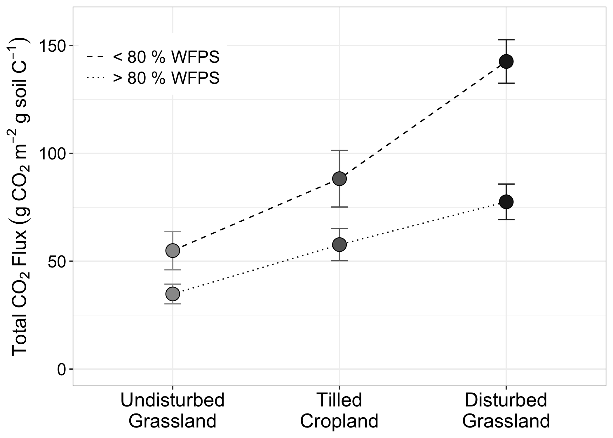
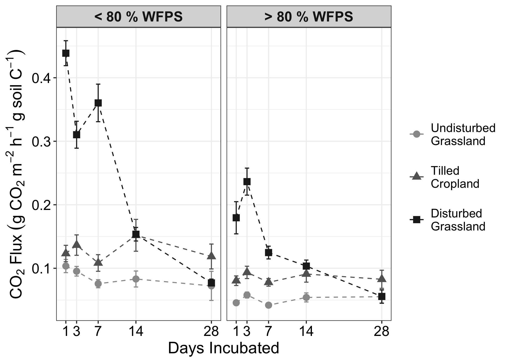

GHG Analysis & Figures
================
Emily Lacroix
09/01/2020

-   [Set-Up](#set-up)
    -   [Load libraries](#load-libraries)
    -   [Designate file paths](#designate-file-paths)
    -   [Figure labels](#figure-labels)
    -   [Set constants](#set-constants)
-   [Import & Clean Data](#import-clean-data)
    -   [Import GHG Data](#import-ghg-data)
    -   [Import gravimetric data](#import-gravimetric-data)
    -   [Import TC data](#import-tc-data)
-   [Flux Calculations](#flux-calculations)
    -   [Calculate the normalized
        fluxes](#calculate-the-normalized-fluxes)
    -   [Calculate cumulative CO2
        production](#calculate-cumulative-co2-production)
    -   [Calculated averages reported in
        text](#calculated-averages-reported-in-text)
-   [Figures](#figures)
    -   [Figure 2 - Cumulative CO2 by moisture &
        tillage](#figure-2---cumulative-co2-by-moisture-tillage)
    -   [Figure S6 - CO2 by moisture & disturbance over
        time](#figure-s6---co2-by-moisture-disturbance-over-time)

## Set-Up

### Load libraries

    library(tidyverse)
    library(readxl)

    conflicted::conflict_prefer("recode", "dplyr")
    conflicted::conflict_prefer("select", "dplyr")
    conflicted::conflict_prefer("filter", "dplyr")

### Designate file paths

    data_file <- "~/Desktop/TempeCell_MasterSpreadsheet.xlsx"

### Figure labels

    moisture_label <- c("low" = "< 80 % WFPS", "high" = "> 80 % WFPS")

    field_labels <- 
      c(
        "RG-3" = "Riparian Grassland",
        "RG-2" = "Riparian Grassland",
        "RG-1" = "Riparian Grassland",
        "RG" = "Riparian Grassland",
        "3-8" = "Wheat/Cover",
        "1-6" = "Wheat/Cover",
        "7-3" = "Wheat/Cover",
        "4-9" = "Wheat/Fallow",
        "1-7" = "Wheat/Fallow",
        "8-3" = "Wheat/Fallow",
        "8-6" = "Native Grassland",
        "3-6" = "Native Grassland",
        "7-1" = "Native Grassland"
      )

### Set constants

    jar_vol_l <- 0.473

    volume_one_mol <- 1 * 8.314 * 298.15 / 101.325   #Ideal gas law: V = nRT/P

    mols_per_l <- 1 / volume_one_mol

    molar_mass_c <- 12.01

    molar_mass_co2 <- 12.01 + (2 * 16) 

    core_surface_area_m2 <- 0.0001 * pi * (5.40 / 2)^2 

## Import & Clean Data

### Import GHG Data

    ghg <- 
      data_file %>% 
      read_excel(sheet = "CO2", na = "NA")

### Import gravimetric data

Filter out any Fe cores as they were not utilized in our incubations

    grav_data <- 
      read_xlsx(
        data_file, 
        sheet = "GravimetricData",
        na = "NA"
      ) %>% 
      filter(!str_detect(sample, "Fe"))

### Import TC data

Summarize OC data to the field-averaged level

    tc <- 
      data_file %>% 
      read_excel(sheet = "TotalCarbon", na = "NA") %>% 
      group_by(field) %>% 
      summarise(
        mean_perc_c = mean(perc_c, na.rm = TRUE), 
        mean_perc_n = mean(perc_n, na.rm = TRUE)
      ) 

    ## `summarise()` ungrouping output (override with `.groups` argument)

## Flux Calculations

### Calculate the normalized fluxes

This code:

-   joins the CO2, gravimetric, and TC data together
-   classifies core moistures into two classes: above and below 80% WFPS
-   calculates the amount of CO2 produced in each jar over 24 hours
-   normalizes this amount to the g of soil C in that core
-   converts the normalized amount to a flux rate
-   summarizes the flux data by moisture, disturbance, and incubation
    day

<!-- -->

    ghg_means_normalized <- 
      ghg %>% 
      left_join(
        grav_data %>% select(-sample), 
        by = c("field", "incubation_day" = "day", "disturbed", "moisture")
      ) %>% 
      left_join(tc, by = "field") %>% 
      mutate(
        AMC = case_when(
          wfps < 0.80 ~ "low",
          wfps >= 0.80 ~ "high")
      ) %>% 
      mutate_at(
        vars(AMC),
        ~ factor(., levels = c("low", "high"))
      ) %>% 
      mutate(
        g_soil_c = (mean_perc_c / 100) * dry_mass,
        headspace_vol_l = jar_vol_l - (ring_vol_cm3 / 1000),
        co2_accum_jar_umol = 
               10^6 * (co2 / 10^6) * headspace_vol_l * mols_per_l,
        co2_accum_jar_g = (co2_accum_jar_umol / 10^6) * molar_mass_co2,
        co2_accum_jar_umol_normalized = co2_accum_jar_umol / g_soil_c,
        co2_accum_g_norm = co2_accum_jar_umol_normalized / 10^6 * molar_mass_co2,
        co2_flux_g_m2_hr_norm = co2_accum_g_norm / (24 * core_surface_area_m2)
      ) %>% 
      mutate_at(
        vars(field),
        ~ recode(., !!!field_labels)
      ) %>% 
      mutate(
        tillage = 
          case_when(
            field %in% c("Wheat/Fallow", "Wheat/Cover") ~ "Tilled Cropland",
            field %in% c("Native Grassland", "Riparian Grassland") & 
              disturbed == FALSE ~ "Undisturbed Grassland",
            field %in% c("Native Grassland", "Riparian Grassland") & 
              disturbed == TRUE ~ "Disturbed Grassland",
          )
      ) %>% 
      mutate_at(
        vars(tillage),
        ~ factor(
          .,
          levels =
            c("Undisturbed Grassland", "Tilled Cropland","Disturbed Grassland"),
          labels = 
            c("Undisturbed\nGrassland", "Tilled\nCropland","Disturbed\nGrassland")
          )
      ) %>% 
      mutate_at(vars(day_sampled), as.integer) %>% 
      group_by(day_sampled, tillage, AMC) %>% 
      summarise( 
        mean_g_co2_rate = mean(co2_flux_g_m2_hr_norm, na.rm = TRUE),
        se_g_co2_rate = 
          sd(co2_flux_g_m2_hr_norm, na.rm = TRUE) / sqrt(n())
      ) 

    ## `summarise()` regrouping output by 'day_sampled', 'tillage' (override with `.groups` argument)

    ghg_means_normalized 

    ## # A tibble: 30 x 5
    ## # Groups:   day_sampled, tillage [15]
    ##    day_sampled tillage                  AMC   mean_g_co2_rate se_g_co2_rate
    ##          <int> <fct>                    <fct>           <dbl>         <dbl>
    ##  1           1 "Undisturbed\nGrassland" low            0.104        0.0104 
    ##  2           1 "Undisturbed\nGrassland" high           0.0457       0.00390
    ##  3           1 "Tilled\nCropland"       low            0.123        0.0129 
    ##  4           1 "Tilled\nCropland"       high           0.0804       0.00753
    ##  5           1 "Disturbed\nGrassland"   low            0.439        0.0197 
    ##  6           1 "Disturbed\nGrassland"   high           0.180        0.0253 
    ##  7           3 "Undisturbed\nGrassland" low            0.0953       0.00756
    ##  8           3 "Undisturbed\nGrassland" high           0.0579       0.00469
    ##  9           3 "Tilled\nCropland"       low            0.136        0.0161 
    ## 10           3 "Tilled\nCropland"       high           0.0935       0.00969
    ## # … with 20 more rows

### Calculate cumulative CO2 production

Using the mean fluxes calculated above, this code:

-   calculates the cumulative CO2 production by moisture and disturbance

<!-- -->

    cumulative_co2_produced <- 
      ghg_means_normalized %>% 
      pivot_wider(
        id_cols = c(tillage, AMC), 
        names_from = day_sampled, 
        values_from = c(mean_g_co2_rate, se_g_co2_rate)
      ) %>% 
      mutate(
        cumulative_g_co2_norm = 
          (mean_g_co2_rate_1 * 24) + 
          ((mean_g_co2_rate_1 + mean_g_co2_rate_3)/2 * 24 * 2) + 
          ((mean_g_co2_rate_3 + mean_g_co2_rate_7)/2 * 24 * 4) + 
          ((mean_g_co2_rate_7 + mean_g_co2_rate_14)/2 * 24 * 7) + 
          ((mean_g_co2_rate_14 + mean_g_co2_rate_28)/2 * 24 * 14),
        se_g_co2_norm = 
          (se_g_co2_rate_1 * 24) + 
          ((se_g_co2_rate_1 + se_g_co2_rate_3)/2 * 24 * 2) + 
          ((se_g_co2_rate_3 + se_g_co2_rate_7)/2 * 24 * 4) + 
          ((se_g_co2_rate_7 + se_g_co2_rate_14)/2 * 24 * 7) + 
          ((se_g_co2_rate_14 + se_g_co2_rate_28)/2 * 24 * 14) 
      ) %>% 
      select(tillage, AMC, cumulative_g_co2_norm, se_g_co2_norm)

    cumulative_co2_produced

    ## # A tibble: 6 x 4
    ## # Groups:   tillage [3]
    ##   tillage                  AMC   cumulative_g_co2_norm se_g_co2_norm
    ##   <fct>                    <fct>                 <dbl>         <dbl>
    ## 1 "Undisturbed\nGrassland" low                    54.9          8.90
    ## 2 "Undisturbed\nGrassland" high                   34.8          4.55
    ## 3 "Tilled\nCropland"       low                    88.2         13.1 
    ## 4 "Tilled\nCropland"       high                   57.7          7.48
    ## 5 "Disturbed\nGrassland"   low                   143.          10.1 
    ## 6 "Disturbed\nGrassland"   high                   77.5          8.22

### Calculated averages reported in text

**Averaged by WFPS**

    cumulative_co2_produced %>% 
      group_by(AMC) %>% 
      summarise(
        avg_cumulative_g_co2_norm = mean(cumulative_g_co2_norm, na.rm = TRUE),
        se_cumulative_g_co2_norm = sqrt(sum(se_g_co2_norm^2)) / n()
      ) %>% 
      knitr::kable()

    ## `summarise()` ungrouping output (override with `.groups` argument)

| AMC  | avg\_cumulative\_g\_co2\_norm | se\_cumulative\_g\_co2\_norm |
|:-----|------------------------------:|-----------------------------:|
| low  |                      95.24692 |                     6.259516 |
| high |                      56.66500 |                     4.001208 |

**Averaged by disturbance**

    cumulative_co2_produced %>% 
      group_by(tillage) %>% 
      summarise(
        avg_cumulative_g_co2_norm = mean(cumulative_g_co2_norm, na.rm = TRUE),
        se_cumulative_g_co2_norm = sqrt(sum(se_g_co2_norm^2)) / n()
      ) %>% 
      knitr::kable()

    ## `summarise()` ungrouping output (override with `.groups` argument)

| tillage     | avg\_cumulative\_g\_co2\_norm | se\_cumulative\_g\_co2\_norm |
|:------------|------------------------------:|-----------------------------:|
| Undisturbed |                               |                              |
| Grassland   |                      44.85418 |                     4.999631 |
| Tilled      |                               |                              |
| Cropland    |                      72.95544 |                     7.546811 |
| Disturbed   |                               |                              |
| Grassland   |                     110.05826 |                     6.498425 |

## Figures

### Figure 2 - Cumulative CO2 by moisture & tillage

    cumulative_co2_produced %>% 
      ggplot(aes(x = tillage, y = cumulative_g_co2_norm)) + 
      geom_line(aes(group = AMC, linetype = AMC)) +
      geom_errorbar(
        aes(
          ymin = cumulative_g_co2_norm - se_g_co2_norm,
          ymax = cumulative_g_co2_norm + se_g_co2_norm,
          color = tillage
        ),
        width = 0.1
      ) + 
      geom_point(aes(fill = tillage), size = 5, shape = 21) + 
      scale_color_manual(values = c("gray60", "grey39", "grey12")) + 
      scale_fill_manual(values = c("gray60", "grey39", "grey12")) + 
      scale_y_continuous(limits = c(0, 160)) + 
      scale_linetype_manual(
        values = c(2,3),
        labels = moisture_label
      ) + 
      guides(
        fill = "none",
        color = "none"
      ) + 
      theme_bw() + 
      theme(
        panel.grid = element_line(colour = "grey94"),
        panel.grid.minor.x = element_blank(),
        legend.position = c(0.15, 0.85),
        axis.text.x = element_text(size = 16, color = "black"),
        axis.text.y = element_text(size = 14, color = "black"),
        axis.title.y = element_text(size = 16), 
        legend.text = element_text(size = 14)
      ) + 
      labs(
        y = expression(Total~CO[2]~Flux~(g~CO[2]~m^-2~g~soil~C^-1)),
        x = NULL,
        color = NULL,
        linetype = NULL
      ) 

<!-- -->

### Figure S6 - CO2 by moisture & disturbance over time

    ghg_means_normalized %>%   
      ggplot(
        aes(x = day_sampled, color = tillage, y = mean_g_co2_rate, shape = tillage)
      ) +
      geom_line(linetype = 2) +
      geom_errorbar(
        aes(
          ymin = mean_g_co2_rate - se_g_co2_rate, 
          ymax = mean_g_co2_rate + se_g_co2_rate
        ),
        width = 0.8
      ) + 
      geom_point(aes(fill = tillage), size = 3) +
      scale_x_continuous(breaks = c(1, 3, 7, 14, 28)) + 
      scale_color_manual(values = c("gray60", "grey39", "grey12")) + 
      facet_grid(
        cols = vars(AMC),
        labeller = labeller(AMC = moisture_label)
      ) + 
      theme_bw() + 
      theme(
        panel.grid = element_line(colour = "grey94"),
        panel.grid.minor.x = element_blank(),
        axis.text.x = element_text(size = 14, color = "black"),
        axis.text.y = element_text(size = 14, color = "black"),
        axis.title.y = element_text(size = 16), 
        axis.title.x = element_text(size = 16), 
        legend.text = element_text(size = 12),
        strip.text.x = element_text(size = 14, face = "bold"),
        legend.key.height =  unit(1.5, "cm")
      ) + 
      labs(
        y = expression(CO[2]~Flux~(g~CO[2]~m^-2~h^-1~g~soil~C^-1)),
        x = "Days Incubated",
        color = NULL,
        fill = NULL,
        shape = NULL
      ) 

<!-- -->
