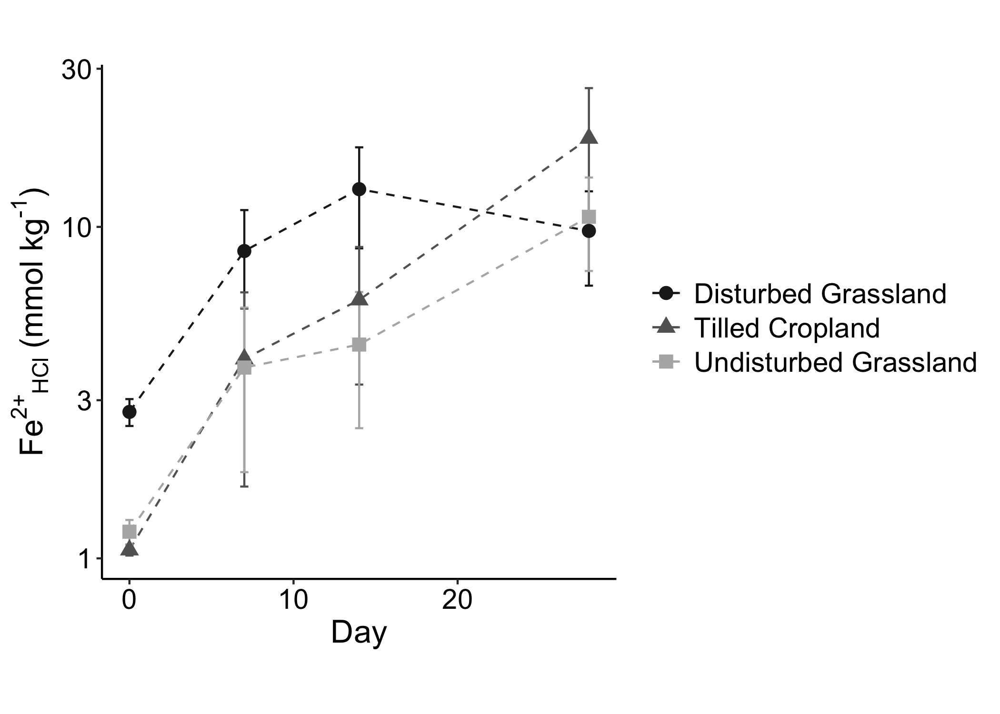
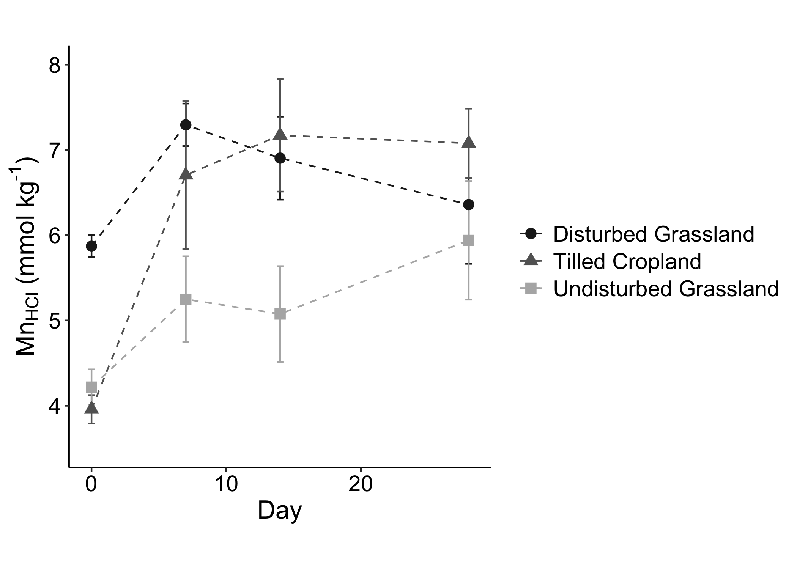
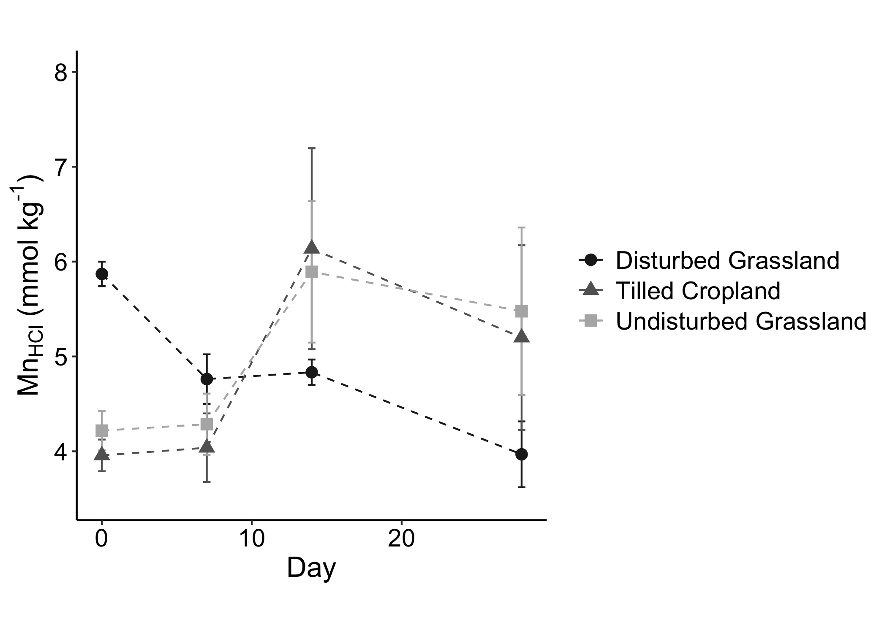

Fe & Mn Analysis & Figures
================
Rob Rossi
4/16/2020

-   [Set-Up](#set-up)
    -   [Load libraries](#load-libraries)
    -   [Define functions](#define-functions)
    -   [Designate file paths](#designate-file-paths)
-   [Import & Clean Data](#import-clean-data)
    -   [Import Fe & Mn Data](#import-fe-mn-data)
    -   [Import gravimetric data](#import-gravimetric-data)
    -   [Clean-up](#clean-up)
-   [Figures](#figures)
    -   [Figure 5a: Fe2+ vs. time for &gt; 80 % WFPS
        cores](#figure-5a-fe2-vs.-time-for-80-wfps-cores)
    -   [Figure 5b: Fe2+ vs. time for &lt; 80 % WFPS
        cores](#figure-5b-fe2-vs.-time-for-80-wfps-cores)
    -   [Figure 5c: Mn vs. time for &gt; 80 % WFPS
        cores](#figure-5c-mn-vs.-time-for-80-wfps-cores)
    -   [Figure 5d: Mn vs. time for &lt; 80 % WFPS
        cores](#figure-5d-mn-vs.-time-for-80-wfps-cores)
-   [Supplementary Figures](#supplementary-figures)
    -   [Figure S7: Proportion Fe2+ vs. Time, &lt;80%
        WFPS](#figure-s7-proportion-fe2-vs.-time-80-wfps)
    -   [Figure S7: Proportion Fe2+ vs. Time, &gt;80%
        WFPS](#figure-s7-proportion-fe2-vs.-time-80-wfps-1)

## Set-Up

### Load libraries

    library("tidyverse")
    library("readxl")
    library("conflicted")

    conflicted::conflict_prefer("recode", "dplyr")
    conflicted::conflict_prefer("select", "dplyr")
    conflicted::conflict_prefer("filter", "dplyr")

### Define functions

    SEM <- function(x) sd(x, na.rm = TRUE)/sqrt(length(na.omit(x)))

### Designate file paths

    data_file <- "~/Desktop/TempeCell_MasterSpreadsheet.xlsx"

## Import & Clean Data

### Import Fe & Mn Data

    metals_data_raw <- 
      data_file %>% 
      read_excel(sheet = "Fe Mn")

### Import gravimetric data

This code:

-   retains gravimetric data for only the Fe and Mn incubation cores

<!-- -->

    grav_data <- 
      read_xlsx(
        data_file, 
        sheet = "GravimetricData",
        na = "NA"
      ) %>% 
      filter(str_detect(sample, "Fe")) 

### Clean-up

This code:

-   Joins the metals data with the gravimetric data
-   Assigns a disturbance class (`simple_type`) to the metals data
-   classifies core moistures into two classes: above and below 80% WFPS
-   averages Fe and Mn concentrations by moisture class, day, and
    `simple_type`

<!-- -->

    metals_means <- 
      metals_data_raw %>% 
      mutate_at(vars(incubated_days), as.integer) %>% 
      mutate_at(vars(target_moisture), ~if_else(. == 75, "70", "FC")) %>% 
      left_join(
        grav_data %>% select(-sample), 
        by = 
          c(
            "field", 
            "incubated_days" = "day", 
            "disturbed", 
            "target_moisture" = "moisture"
          )
      ) %>% 
      mutate(
        simple_type = case_when(
          crop == "Wheat/Cover" | crop == "Wheat/Fallow" ~ "Tilled Cropland",
          disturbed == TRUE ~ "Disturbed Grassland",
          TRUE ~ "Undisturbed Grassland")
      ) %>%
      mutate(
        AMC = case_when(
          wfps <= 0.80 ~ "low",
          wfps > 0.80 ~ "high")
      ) %>% 
      group_by(simple_type, AMC, incubated_days) %>%
      summarise(
        FeII.mean  = mean(FeII.HCl),
        FeII.SEM   = SEM(FeII.HCl),
        Mn.mean    = mean(Mn.HCl),
        Mn.SEM     = SEM(Mn.HCl),
        propFeII.mean = mean(FeII.HCl / Fe.HCl),
        propFeII.SEM = SEM(FeII.HCl / Fe.HCl)
      )

    ## `summarise()` regrouping output by 'simple_type', 'AMC' (override with `.groups` argument)

## Figures

Note:

-   Final formatting was performed in a graphics editor outside of R
    Studio
-   Day 0 cores represent field soils and are the same for each moisture
    class

### Figure 5a: Fe2+ vs. time for &gt; 80 % WFPS cores

    metals_means %>% 
      ungroup() %>% 
      mutate_at(vars(AMC), ~ if_else(is.na(.), "high", .)) %>% 
      filter(AMC == "high") %>% 
      ggplot(
        aes(
          x = incubated_days,
          y = FeII.mean, 
          color = simple_type,
          shape = simple_type
        )
      ) +
      geom_line(aes(group = simple_type), linetype = 2) + 
      geom_errorbar(
        aes(ymin = FeII.mean - FeII.SEM, ymax = FeII.mean + FeII.SEM), 
        width = 0.5
      ) + 
      geom_point(size = 3) + 
      scale_y_log10() + 
      scale_color_manual(values = c("gray12", "grey39", "grey70")) + 
      labs(
        x = "Day",
        y = expression(paste("Fe"^"2+"*""["HCl"]*" (mmol kg"^"-1"*")", sep="")),
        fill = NULL,
        color = NULL,
        shape = NULL
      ) + 
      theme_classic() + 
      theme(
        axis.text.x = element_text(size = 14, color = "black"),
        axis.text.y = element_text(size = 14, color = "black"),
        axis.title.x = element_text(size = 16), 
        axis.title.y = element_text(size = 16), 
        legend.text = element_text(size = 14),
        aspect.ratio = 1
      ) 

<!-- -->

### Figure 5b: Fe2+ vs. time for &lt; 80 % WFPS cores

    metals_means %>% 
      ungroup() %>% 
      mutate_at(vars(AMC), ~ if_else(is.na(.), "low", .)) %>% 
      filter(AMC == "low") %>% 
      ggplot(
        aes(
          x = incubated_days,
          y = FeII.mean, 
          color = simple_type,
          shape = simple_type
        )
      ) +
      geom_line(aes(group = simple_type), linetype = 2) + 
      geom_errorbar(
        aes(ymin = FeII.mean - FeII.SEM, ymax = FeII.mean + FeII.SEM), 
        width = 0.5
      ) + 
      geom_point(size = 3) + 
      scale_y_log10(limits = c(0.9, 30)) + 
      scale_color_manual(values = c("gray12", "grey39", "grey70")) + 
      scale_fill_manual(values = c("gray12", "grey39", "grey70")) + 
      labs(
        x = "Day",
        #y = expression(paste("mmol Fe"^2^"+"," kg soil"^"-1")),
        y = expression(paste("Fe"^"2+"*""["HCl"]*" (mmol kg"^"-1"*")", sep="")),
        fill = NULL,
        color = NULL,
        shape = NULL
      ) + 
      theme_classic() + 
      theme(
        axis.text.x = element_text(size = 14, color = "black"),
        axis.text.y = element_text(size = 14, color = "black"),
        axis.title.x = element_text(size = 16), 
        axis.title.y = element_text(size = 16), 
        legend.text = element_text(size = 14),
        aspect.ratio = 1
      ) 

<!-- -->

### Figure 5c: Mn vs. time for &gt; 80 % WFPS cores

    metals_means %>% 
      ungroup() %>% 
      mutate_at(vars(AMC), ~ if_else(is.na(.), "high", .)) %>% 
      filter(AMC == "high") %>% 
      ggplot(
        aes(
          x = incubated_days,
          y = Mn.mean, 
          color = simple_type,
          shape = simple_type
        )
      ) +
      geom_line(aes(group = simple_type), linetype = 2) + 
      geom_errorbar(
        aes(ymin = Mn.mean - Mn.SEM, ymax = Mn.mean + Mn.SEM), 
        width = 0.5
      ) + 
      geom_point(size = 3) + 
      scale_color_manual(values = c("gray12", "grey39", "grey70")) + 
      scale_y_continuous(limits = c(3.5, 8)) + 
      labs(
        x = "Day",
        #y = expression(paste("mmol Mn kg soil"^"-1")),
        y = expression(paste("Mn"["HCl"]*" (mmol kg"^"-1"*")", sep="")),
        #y = "mmol Mn kg soil -1", 
        fill = NULL,
        color = NULL,
        shape = NULL
      ) + 
      theme_classic() + 
      theme(
        axis.text.x = element_text(size = 14, color = "black"),
        axis.text.y = element_text(size = 14, color = "black"),
        axis.title.x = element_text(size = 16), 
        axis.title.y = element_text(size = 16), 
        legend.text = element_text(size = 14),
        aspect.ratio = 1
      ) 

<!-- -->

### Figure 5d: Mn vs. time for &lt; 80 % WFPS cores

    metals_means %>% 
      ungroup() %>% 
      mutate_at(vars(AMC), ~ if_else(is.na(.), "low", .)) %>% 
      filter(AMC == "low") %>% 
      ggplot(
        aes(
          x = incubated_days,
          y = Mn.mean, 
          color = simple_type,
          shape = simple_type
        )
      ) +
      geom_line(aes(group = simple_type), linetype = 2) + 
      geom_errorbar(
        aes(ymin = Mn.mean - Mn.SEM, ymax = Mn.mean + Mn.SEM), 
        width = 0.5
      ) + 
      geom_point(size = 3) + 
      scale_color_manual(values = c("gray12", "grey39", "grey70")) + 
      scale_y_continuous(limits = c(3.5, 8)) + 
      labs(
        x = "Day",
        y = expression(paste("Mn"["HCl"]*" (mmol kg"^"-1"*")", sep="")),
        fill = NULL,
        color = NULL,
        shape = NULL
      ) + 
      theme_classic() + 
      theme(
        axis.text.x = element_text(size = 14, color = "black"),
        axis.text.y = element_text(size = 14, color = "black"),
        axis.title.x = element_text(size = 16), 
        axis.title.y = element_text(size = 16), 
        legend.text = element_text(size = 14),
        aspect.ratio = 1
      ) 

<!-- -->

## Supplementary Figures

### Figure S7: Proportion Fe2+ vs. Time, &lt;80% WFPS

    metals_means %>% 
      ungroup() %>% 
      mutate_at(vars(AMC), ~ if_else(is.na(.), "low", .)) %>% 
      filter(AMC == "low") %>% 
      ggplot(
        aes(
          x = incubated_days,
          y = propFeII.mean, 
          color = simple_type,
          shape = simple_type
        )
      ) +
      geom_line(aes(group = simple_type), linetype = 2) + 
      geom_errorbar(
        aes(
          ymin = propFeII.mean - propFeII.SEM, 
          ymax = propFeII.mean + propFeII.SEM
        ),
        width = 0.5
      ) +
      geom_point(size = 3) + 
      scale_y_continuous(breaks = c(0.1, 0.2, 0.3, 0.4, 0.5), limits = c(0, 0.5)) +
      scale_color_manual(
        values = c("gray12", "grey39", "grey70"),
        labels = 
          c("Disturbed Grassland","Tilled Cropland", "Undisturbed Grassland")
      ) + 
      #scale_fill_manual(values = c("gray12", "grey39", "grey60")) + 
      labs(
        x = "Day",
        y = "Fe2+ / Total Extractable Fe", 
        fill = NULL,
        color = NULL,
        shape = NULL
      ) + 
      theme_classic() 

<!-- -->

### Figure S7: Proportion Fe2+ vs. Time, &gt;80% WFPS

    metals_means %>% 
      ungroup() %>% 
      mutate_at(vars(AMC), ~ if_else(is.na(.), "high", .)) %>% 
      filter(AMC == "high") %>% 
      ggplot(
        aes(
          x = incubated_days,
          y = propFeII.mean, 
          color = simple_type,
          shape = simple_type
        )
      ) +
      geom_line(aes(group = simple_type), linetype = 2) + 
      geom_errorbar(
        aes(
          ymin = propFeII.mean - propFeII.SEM, 
          ymax = propFeII.mean + propFeII.SEM
        ),
        width = 0.5
      ) +
      geom_point(size = 3) + 
      scale_color_manual(
        values = c("gray12", "grey39", "grey60"),
        labels = 
          c("Disturbed Grassland","Tilled Cropland", "Undisturbed Grassland")
      ) + 
      scale_y_continuous(breaks = c(0.1, 0.2, 0.3, 0.4, 0.5), limits = c(0, 0.5)) +
      labs(
        x = "Day",
        y = "Fe2+ / Total Extractable Fe", 
        fill = NULL,
        color = NULL,
        shape = NULL
      ) + 
      theme_classic() 

<!-- -->
