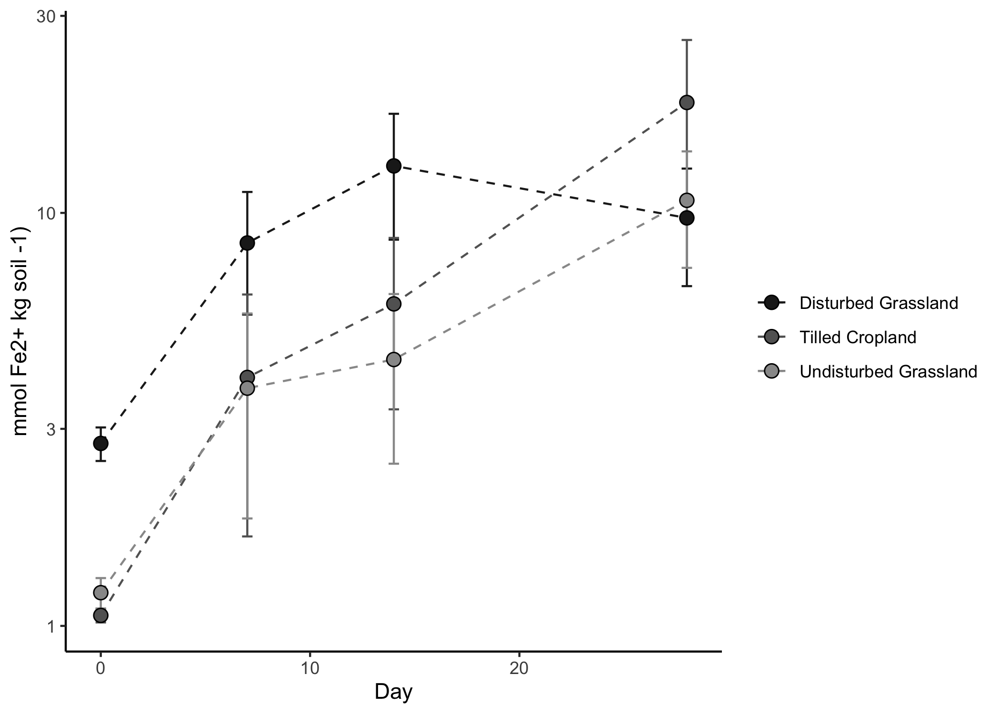
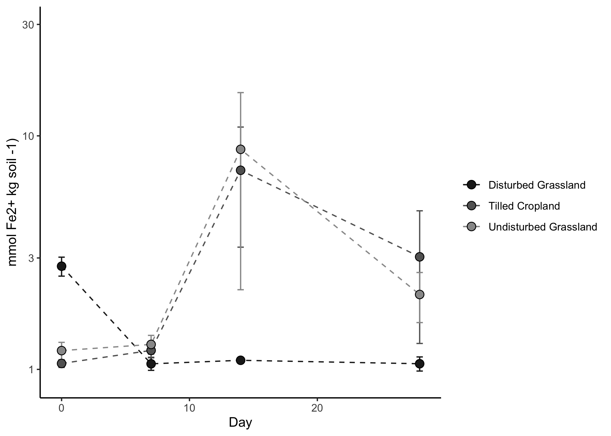
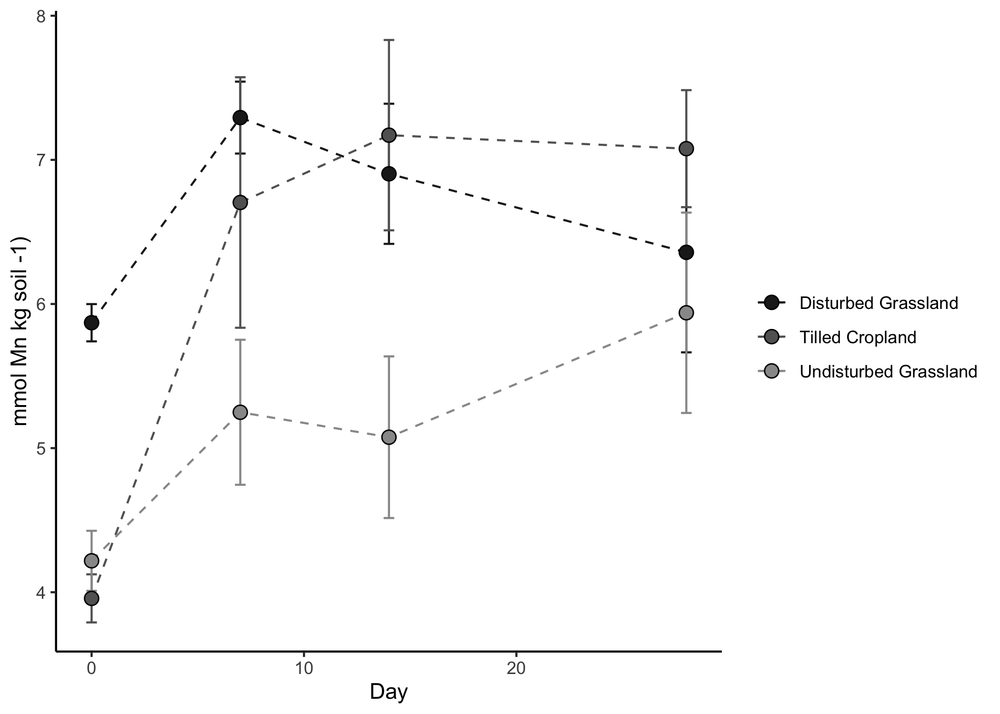
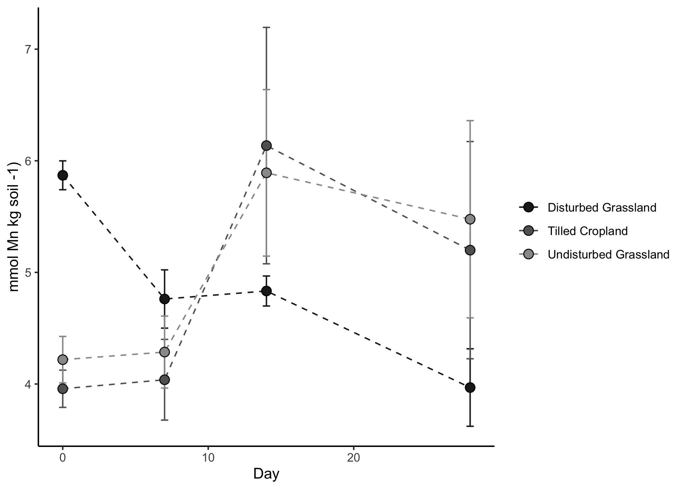

Fe & Mn Analysis & Figures
================
Rob Rossi
4/16/2020

## Set-Up

### Load libraries

``` r
library("tidyverse")
library("readxl")

conflicted::conflict_prefer("recode", "dplyr")
conflicted::conflict_prefer("select", "dplyr")
conflicted::conflict_prefer("filter", "dplyr")
```

### Define functions

``` r
SEM <- function(x) sd(x, na.rm = TRUE)/sqrt(length(na.omit(x)))
```

### Designate file paths

``` r
data_file <- "~/Desktop/TempeCell_MasterSpreadsheet.xlsx"
```

## Import & Clean Data

### Import Fe & Mn Data

``` r
metals_data_raw <- 
  data_file %>% 
  read_excel(sheet = "Fe Mn")
```

### Import gravimetric data

This code:

  - retains gravimetric data for only the Fe and Mn incubation cores

<!-- end list -->

``` r
grav_data <- 
  read_xlsx(
    data_file, 
    sheet = "GravimetricData",
    na = "NA"
  ) %>% 
  filter(str_detect(sample, "Fe")) 
```

### Clean-up

This code:

  - Joins the metals data with the gravimetric data
  - Assigns a disturbance class (`simple_type`) to the metals data
  - classifies core moistures into two classes: above and below 80% WFPS
  - averages Fe and Mn concentrations by moisture class, day, and
    `simple_type`

<!-- end list -->

``` r
metals_means <- 
  metals_data_raw %>% 
  mutate_at(vars(incubated_days), as.integer) %>% 
  mutate_at(vars(target_moisture), ~if_else(. == 75, "70", "FC")) %>% 
  left_join(
    grav_data %>% select(-sample), 
    by = 
      c(
        "field", 
        "incubated_days" = "day", 
        "disturbed", 
        "target_moisture" = "moisture"
      )
  ) %>% 
  mutate(
    simple_type = case_when(
      crop == "Wheat/Cover" | crop == "Wheat/Fallow" ~ "Tilled Cropland",
      disturbed == TRUE ~ "Disturbed Grassland",
      TRUE ~ "Undisturbed Grassland")
  ) %>%
  mutate(
    AMC = case_when(
      wfps <= 0.80 ~ "low",
      wfps > 0.80 ~ "high")
  ) %>% 
  group_by(simple_type, AMC, incubated_days) %>%
  summarise(
    FeII.mean  = mean(FeII.HCl),
    FeII.SEM   = SEM(FeII.HCl),
    Mn.mean    = mean(Mn.HCl),
    Mn.SEM     = SEM(Mn.HCl)
  )
```

## Figures

Note:

  - Final formatting was performed in a graphics editor outside of R
    Studio
  - Day 0 cores represent field soils and are the same for each moisture
    class

### Figure 5a: Fe2+ vs. time for \> 80 % WFPS cores

``` r
metals_means %>% 
  ungroup() %>% 
  mutate_at(vars(AMC), ~ if_else(is.na(.), "high", .)) %>% 
  filter(AMC == "high") %>% 
  ggplot(
    aes(
      x = incubated_days,
      y = FeII.mean, 
      fill = simple_type, 
      color = simple_type
    )
  ) +
  geom_line(aes(group = simple_type), linetype = 2) + 
  geom_errorbar(
    aes(ymin = FeII.mean - FeII.SEM, ymax = FeII.mean + FeII.SEM), 
    width = 0.5
  ) + 
  geom_point(shape = 21, color = "black", size = 3) + 
  scale_y_log10() + 
  scale_color_manual(values = c("gray12", "grey39", "grey60")) + 
  scale_fill_manual(values = c("gray12", "grey39", "grey60")) + 
  labs(
    x = "Day",
    y = "mmol Fe2+ kg soil -1)", 
    fill = NULL,
    color = NULL
  ) + 
  theme_classic() 
```

<!-- -->

### Figure 5b: Fe2+ vs. time for \< 80 % WFPS cores

``` r
metals_means %>% 
  ungroup() %>% 
  mutate_at(vars(AMC), ~ if_else(is.na(.), "low", .)) %>% 
  filter(AMC == "low") %>% 
  ggplot(
    aes(
      x = incubated_days,
      y = FeII.mean, 
      fill = simple_type, 
      color = simple_type
    )
  ) +
  geom_line(aes(group = simple_type), linetype = 2) + 
  geom_errorbar(
    aes(ymin = FeII.mean - FeII.SEM, ymax = FeII.mean + FeII.SEM), 
    width = 0.5
  ) + 
  geom_point(shape = 21, color = "black", size = 3) + 
  scale_y_log10(limits = c(0.9, 30)) + 
  scale_color_manual(values = c("gray12", "grey39", "grey60")) + 
  scale_fill_manual(values = c("gray12", "grey39", "grey60")) + 
  labs(
    x = "Day",
    y = "mmol Fe2+ kg soil -1)", 
    fill = NULL,
    color = NULL
  ) + 
  theme_classic() 
```

<!-- -->

### Figure 5c: Mn vs. time for \> 80 % WFPS cores

``` r
metals_means %>% 
  ungroup() %>% 
  mutate_at(vars(AMC), ~ if_else(is.na(.), "high", .)) %>% 
  filter(AMC == "high") %>% 
  ggplot(
    aes(
      x = incubated_days,
      y = Mn.mean, 
      fill = simple_type, 
      color = simple_type
    )
  ) +
  geom_line(aes(group = simple_type), linetype = 2) + 
  geom_errorbar(
    aes(ymin = Mn.mean - Mn.SEM, ymax = Mn.mean + Mn.SEM), 
    width = 0.5
  ) + 
  geom_point(shape = 21, color = "black", size = 3) + 
  scale_color_manual(values = c("gray12", "grey39", "grey60")) + 
  scale_fill_manual(values = c("gray12", "grey39", "grey60")) + 
  labs(
    x = "Day",
    y = "mmol Mn kg soil -1)", 
    fill = NULL,
    color = NULL
  ) + 
  theme_classic() 
```

<!-- -->

### Figure 5d: Mn vs. time for \< 80 % WFPS cores

``` r
metals_means %>% 
  ungroup() %>% 
  mutate_at(vars(AMC), ~ if_else(is.na(.), "low", .)) %>% 
  filter(AMC == "low") %>% 
  ggplot(
    aes(
      x = incubated_days,
      y = Mn.mean, 
      fill = simple_type, 
      color = simple_type
    )
  ) +
  geom_line(aes(group = simple_type), linetype = 2) + 
  geom_errorbar(
    aes(ymin = Mn.mean - Mn.SEM, ymax = Mn.mean + Mn.SEM), 
    width = 0.5
  ) + 
  geom_point(shape = 21, color = "black", size = 3) + 
  scale_color_manual(values = c("gray12", "grey39", "grey60")) + 
  scale_fill_manual(values = c("gray12", "grey39", "grey60")) + 
  labs(
    x = "Day",
    y = "mmol Mn kg soil -1)", 
    fill = NULL,
    color = NULL
  ) + 
  theme_classic() 
```

<!-- -->
