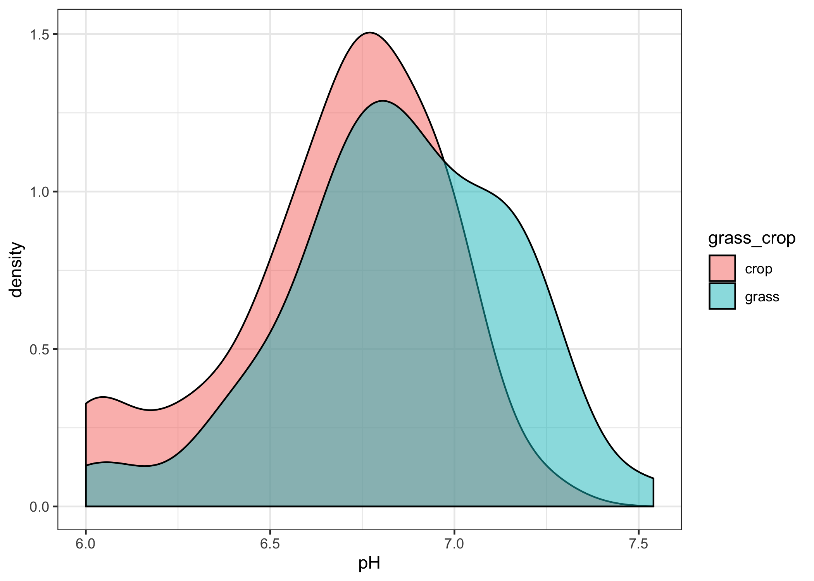
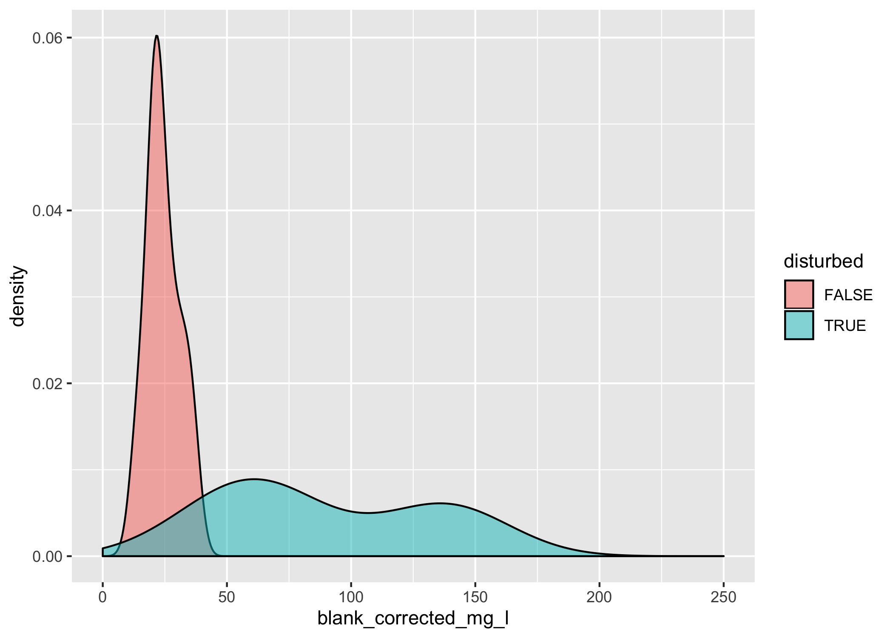
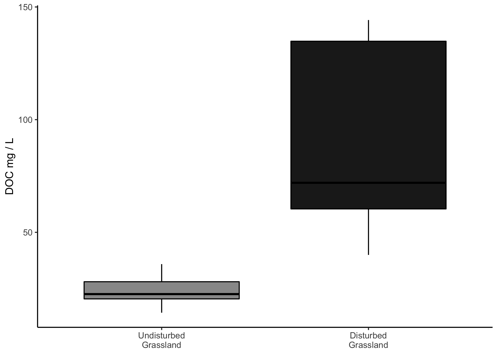

Ancillary Analyses
================
Emily Lacroix
4/16/2020

## Set-Up

### Load libraries

``` r
library(tidyverse)
library(readxl)
library(car)

conflicted::conflict_prefer("recode", "dplyr")
conflicted::conflict_prefer("select", "dplyr")
conflicted::conflict_prefer("filter", "dplyr")
```

### Designate file paths

``` r
data_file <- "~/Desktop/TempeCell_MasterSpreadsheet.xlsx"
```

### Figure labels

``` r
field_labels <- 
  c(
    "RG-3" = "Riparian Grassland",
    "RG-2" = "Riparian Grassland",
    "RG-1" = "Riparian Grassland",
    "RG" = "Riparian Grassland",
    "3-8" = "Wheat/Cover",
    "1-6" = "Wheat/Cover",
    "7-3" = "Wheat/Cover",
    "4-9" = "Wheat/Fallow",
    "1-7" = "Wheat/Fallow",
    "8-3" = "Wheat/Fallow",
    "8-6" = "Native Grassland",
    "3-6" = "Native Grassland",
    "7-1" = "Native Grassland"
  )
```

## Import Data

### TC and TN data

``` r
tc <- 
  data_file %>% 
  read_excel(sheet = "TotalCarbon", na = "NA") 
```

### pH data

``` r
ph <- 
  data_file %>% 
  read_excel(sheet = "pH")
```

### XRF (total Fe & Mn) data

``` r
xrf <-
  data_file %>% 
  read_excel(sheet = "XRF")
```

### Gravimetric data

``` r
grav_data <- 
  read_xlsx(
    data_file, 
    sheet = "GravimetricData",
    na = "NA"
  ) 
```

### Texture data

``` r
texture <-
  data_file %>% 
  read_excel(sheet = "Texture")
```

### DOC data

``` r
doc <-
  data_file %>% 
  read_excel(sheet = "DissolvedOrganicCarbon") %>% 
  select(-comments) %>% 
  filter(!str_detect(sample_name, "Blank")) %>% 
  mutate(
    disturbed = if_else(str_detect(sample_name, "-D"), TRUE, FALSE)
  )
```

## Figures & Analysis

### Table 1: % OC and TN

``` r
tc %>% 
  mutate_at(
    vars(field),
    ~ recode(., !!!field_labels)
  ) %>% 
  mutate(
    grass_crop = 
      if_else(
        field %in% c("Riparian Grassland", "Native Grassland"), 
        "grass", 
        "crop"
      )
  ) %>% 
  group_by(grass_crop) %>% 
  summarise_at(
    vars(perc_c, perc_n), 
    list(
      mean = ~mean(., na.rm = TRUE), 
      se = ~sd(., na.rm = TRUE) / sqrt(n())
    )
  ) %>% 
  select(grass_crop, perc_c_mean, perc_c_se, perc_n_mean, perc_n_se) %>% 
  knitr::kable()
```

| grass\_crop | perc\_c\_mean | perc\_c\_se | perc\_n\_mean | perc\_n\_se |
| :---------- | ------------: | ----------: | ------------: | ----------: |
| crop        |     0.9640565 |   0.0387414 |     0.0864855 |   0.0030530 |
| grass       |     1.3085631 |   0.0863740 |     0.1091552 |   0.0054678 |

### OC & TN Stats

``` r
tc_stats <- 
  tc %>% 
  mutate_at(
    vars(field),
    ~ recode(., !!!field_labels)
  ) %>% 
  mutate(
    grass_crop = 
      if_else(
        field %in% c("Riparian Grassland", "Native Grassland"), 
        "grass", 
        "crop"
      )
  )
```

``` r
tc_stats %>% 
  group_by(grass_crop) %>% 
  summarise(
    normality_shapiro_p_oc = shapiro.test(perc_c)$p.value,
    normality_shapiro_p_tn = shapiro.test(perc_n)$p.value,
  )
```

    ## # A tibble: 2 x 3
    ##   grass_crop normality_shapiro_p_oc normality_shapiro_p_tn
    ##   <chr>                       <dbl>                  <dbl>
    ## 1 crop                      0.100                   0.0776
    ## 2 grass                     0.00827                 0.0283

The grassland data are not normally distributed. Checking for equal
variances.

``` r
leveneTest(perc_c ~ grass_crop, data = tc_stats)
```

    ## Warning in leveneTest.default(y = y, group = group, ...): group coerced to
    ## factor.

    ## Levene's Test for Homogeneity of Variance (center = median)
    ##       Df F value    Pr(>F)    
    ## group  1  19.353 5.853e-05 ***
    ##       49                      
    ## ---
    ## Signif. codes:  0 '***' 0.001 '**' 0.01 '*' 0.05 '.' 0.1 ' ' 1

``` r
leveneTest(perc_n ~ grass_crop, data = tc_stats)
```

    ## Warning in leveneTest.default(y = y, group = group, ...): group coerced to
    ## factor.

    ## Levene's Test for Homogeneity of Variance (center = median)
    ##       Df F value    Pr(>F)    
    ## group  1   12.36 0.0009553 ***
    ##       49                      
    ## ---
    ## Signif. codes:  0 '***' 0.001 '**' 0.01 '*' 0.05 '.' 0.1 ' ' 1

### Table 1: pH

``` r
ph %>% 
  mutate(
    grass_crop = 
      if_else(
        crop %in% c("Riparian Grassland", "Native Grassland"), 
        "grass", 
        "crop"
      )
  ) %>% 
  group_by(grass_crop) %>% 
  summarise_at(
    vars(pH), 
    list(
      mean = ~mean(., na.rm = TRUE), 
      se = ~sd(., na.rm = TRUE) / sqrt(n())
    )
  ) %>% 
  knitr::kable()
```

| grass\_crop |     mean |        se |
| :---------- | -------: | --------: |
| crop        | 6.676458 | 0.0428748 |
| grass       | 6.846458 | 0.0447981 |

### pH Stats

``` r
ph_stats <- 
  ph %>% 
  mutate(
    grass_crop = 
      if_else(
        crop %in% c("Riparian Grassland", "Native Grassland"), 
        "grass", 
        "crop"
      )
  ) 
```

``` r
ph_stats %>% 
  group_by(grass_crop) %>% 
  ggplot(aes(x = pH, fill = grass_crop)) + 
  geom_density(alpha = 0.5) + 
  scale_x_continuous() + 
  theme_bw()
```

<!-- -->

``` r
ph_stats %>% 
  group_by(grass_crop) %>% 
  summarise(
    normality_p_val = shapiro.test(pH)$p.value
  )
```

    ## # A tibble: 2 x 2
    ##   grass_crop normality_p_val
    ##   <chr>                <dbl>
    ## 1 crop                0.0134
    ## 2 grass               0.271

The crop data are
    non-normal

``` r
leveneTest(pH ~ grass_crop, data = ph_stats)
```

    ## Warning in leveneTest.default(y = y, group = group, ...): group coerced to
    ## factor.

    ## Levene's Test for Homogeneity of Variance (center = median)
    ##       Df F value Pr(>F)
    ## group  1  0.1707 0.6804
    ##       94

The variances are equal. Use Wilcoxon signed-rank test.

``` r
pairwise.wilcox.test(
  x = ph_stats$pH, 
  g = ph_stats$grass_crop, 
  p.adjust.method = "none", 
  paired = FALSE
)
```

    ## Warning in wilcox.test.default(xi, xj, paired = paired, ...): cannot
    ## compute exact p-value with ties

    ## 
    ##  Pairwise comparisons using Wilcoxon rank sum test 
    ## 
    ## data:  ph_stats$pH and ph_stats$grass_crop 
    ## 
    ##       crop  
    ## grass 0.0093
    ## 
    ## P value adjustment method: none

### Table 1: Fe and Mn Content

For these data, we assume that soils across the grassland and cropland
treatments have approximately equal elemental composition

``` r
xrf %>% 
  summarise_at(
    vars(mn_ug_per_g, fe_ug_per_g), 
    list(
      mean = ~mean(., na.rm = TRUE),
      se =  ~sd(., na.rm = TRUE) / sqrt(n())
    )
  ) %>% 
  mutate(
    perc_fe = fe_ug_per_g_mean / 10^6 * 100, #unit converison
    se_perc_fe = fe_ug_per_g_se / 10^6 * 100, # unit conversion 
    mn_mg_kg = mn_ug_per_g_mean, # same values after unit conversion
    se_mn_mg_kg = mn_ug_per_g_se #same values after unit conversion
  ) %>% 
  select(perc_fe, se_perc_fe, mn_mg_kg, se_mn_mg_kg) %>% 
  knitr::kable()
```

| perc\_fe | se\_perc\_fe | mn\_mg\_kg | se\_mn\_mg\_kg |
| -------: | -----------: | ---------: | -------------: |
|     4.76 |        0.088 |     789.85 |          47.15 |

### Table 1: Bulk Density

This focuses only on field cores, not disturbed cores as that bulk
density is contrived.

``` r
grav_data %>% 
  mutate_at(
    vars(field),
    ~ recode(., !!!field_labels)
  ) %>% 
  filter(disturbed == FALSE) %>% 
  mutate(
    grass_crop = 
      if_else(
        field %in% c("Riparian Grassland", "Native Grassland"), 
        "grass", 
        "crop"
      )
  ) %>% 
  group_by(grass_crop) %>% 
  summarise_at(
    vars(bulk_dens), 
    list(
      mean_bulk_dens = ~mean(., na.rm = TRUE), 
      se_bulk_dens = ~sd(., na.rm = TRUE) / sqrt(n())
    )
  ) %>% 
  knitr::kable()
```

| grass\_crop | mean\_bulk\_dens | se\_bulk\_dens |
| :---------- | ---------------: | -------------: |
| crop        |         1.156066 |      0.0118193 |
| grass       |         1.325178 |      0.0141460 |

### Table S2: Bulk Density by Field

This focuses only on field cores, not disturbed cores as that bulk
density is contrived.

``` r
grav_data %>% 
  filter(disturbed == FALSE) %>% 
  group_by(field) %>% 
  summarise_at(
    vars(bulk_dens), 
    list(
      mean_bulk_dens = ~round(mean(., na.rm = TRUE), digits = 2), 
      se_bulk_dens = ~round(sd(., na.rm = TRUE) / sqrt(n()), digits = 2)
    )
  ) %>% 
  mutate(
    field_type = recode(field, !!!field_labels),
    grass_crop = 
      if_else(
        field_type %in% c("Riparian Grassland", "Native Grassland"), 
        "grass", 
        "crop"
      )
  ) %>% 
  select(grass_crop, field_type, field, mean_bulk_dens, se_bulk_dens) %>% 
  arrange(grass_crop, field_type, field) %>% 
  knitr::kable()
```

| grass\_crop | field\_type        | field | mean\_bulk\_dens | se\_bulk\_dens |
| :---------- | :----------------- | :---- | ---------------: | -------------: |
| crop        | Wheat/Cover        | 1-6   |             1.16 |           0.02 |
| crop        | Wheat/Cover        | 3-8   |             1.19 |           0.02 |
| crop        | Wheat/Cover        | 7-3   |             1.12 |           0.04 |
| crop        | Wheat/Fallow       | 1-7   |             1.13 |           0.02 |
| crop        | Wheat/Fallow       | 4-9   |             1.24 |           0.02 |
| crop        | Wheat/Fallow       | 8-3   |             1.10 |           0.03 |
| grass       | Native Grassland   | 3-6   |             1.31 |           0.03 |
| grass       | Native Grassland   | 7-1   |             1.31 |           0.04 |
| grass       | Native Grassland   | 8-6   |             1.42 |           0.03 |
| grass       | Riparian Grassland | RG-1  |             1.35 |           0.02 |
| grass       | Riparian Grassland | RG-2  |             1.28 |           0.03 |
| grass       | Riparian Grassland | RG-3  |             1.29 |           0.05 |

### Table 1: Texture

``` r
texture %>% 
  mutate(
    grass_crop = 
      case_when(
        str_detect(sample, "^(WF|WC|CW)") ~ "crop",
        str_detect(sample, "^(NG|RG)") ~ "grass"
      )
  ) %>% 
  group_by(grass_crop) %>% 
  summarise_at(
    vars(perc_sand, perc_silt, perc_clay), 
    list(
      mean = ~mean(., na.rm = TRUE),
      se = ~sd(., na.rm = TRUE) / sqrt(n())
    )
  ) %>% 
  select(
    grass_crop,
    perc_sand_mean,
    perc_sand_se,
    perc_silt_mean,
    perc_silt_se,
    perc_clay_mean,
    perc_clay_se
  ) %>% 
  knitr::kable()
```

| grass\_crop | perc\_sand\_mean | perc\_sand\_se | perc\_silt\_mean | perc\_silt\_se | perc\_clay\_mean | perc\_clay\_se |
| :---------- | ---------------: | -------------: | ---------------: | -------------: | ---------------: | -------------: |
| crop        |         17.27308 |      0.9119979 |         62.90385 |      0.6923423 |         19.81154 |      0.2970277 |
| grass       |         25.99524 |      1.9353783 |         57.24762 |      1.1413989 |         16.76667 |      0.8588845 |

### DOC means

``` r
doc %>% 
  group_by(disturbed) %>% 
  summarise(mean_doc = mean(blank_corrected_mg_l, na.rm = TRUE)) %>% 
  knitr::kable()
```

| disturbed | mean\_doc |
| :-------- | --------: |
| FALSE     |  24.32253 |
| TRUE      |  89.40139 |

### DOC Stats

``` r
doc %>% 
  ggplot(aes(x = blank_corrected_mg_l, fill = disturbed)) + 
  geom_density(alpha = 0.5) + 
  scale_x_continuous(limits = c(0, 250))
```

<!-- -->

``` r
doc %>% 
  group_by(disturbed) %>% 
  summarise(
    normality_p = shapiro.test(blank_corrected_mg_l)$p.value
  )
```

    ## # A tibble: 2 x 2
    ##   disturbed normality_p
    ##   <lgl>           <dbl>
    ## 1 FALSE          0.825 
    ## 2 TRUE           0.0960

The data are approximately normally distributed (alpha = 0.05).

``` r
leveneTest(
  blank_corrected_mg_l ~ disturbed, 
  data = doc %>% 
    filter(!str_detect(sample_name, "Blank")) %>% 
    mutate(
      disturbed = if_else(str_detect(sample_name, "-D"), TRUE, FALSE)
    ) 
)
```

    ## Warning in leveneTest.default(y = y, group = group, ...): group coerced to
    ## factor.

    ## Levene's Test for Homogeneity of Variance (center = median)
    ##       Df F value  Pr(>F)  
    ## group  1  8.2762 0.01219 *
    ##       14                  
    ## ---
    ## Signif. codes:  0 '***' 0.001 '**' 0.01 '*' 0.05 '.' 0.1 ' ' 1

However, the variances are unequal.

``` r
t.test(
  x = doc %>% filter(disturbed == TRUE) %>% pull(blank_corrected_mg_l),
  y = doc %>% filter(disturbed == FALSE) %>% pull(blank_corrected_mg_l),
  var.equal = FALSE
  )
```

    ## 
    ##  Welch Two Sample t-test
    ## 
    ## data:  doc %>% filter(disturbed == TRUE) %>% pull(blank_corrected_mg_l) and doc %>% filter(disturbed == FALSE) %>% pull(blank_corrected_mg_l)
    ## t = 4.3314, df = 7.3737, p-value = 0.003037
    ## alternative hypothesis: true difference in means is not equal to 0
    ## 95 percent confidence interval:
    ##   29.91201 100.24570
    ## sample estimates:
    ## mean of x mean of y 
    ##  89.40139  24.32254

### Figure S5: DOC Boxplots

``` r
doc %>% 
  filter(!str_detect(sample_name, "Blank")) %>% 
  mutate(
    disturbed = if_else(str_detect(sample_name, "-D"), TRUE, FALSE)
  ) %>% 
  ggplot(aes(x = disturbed, y = blank_corrected_mg_l, fill = disturbed)) + 
  geom_boxplot(color = "black") + 
  scale_fill_manual(values = c("gray60", "grey12")) + 
  scale_x_discrete(
    labels = c("Undisturbed\nGrassland", "Disturbed\nGrassland")
  ) + 
  labs(
    x = NULL,
    y = "DOC mg / L"
  ) + 
  theme_classic() + 
  theme(
    legend.position = "none"
  )
```

<!-- -->
