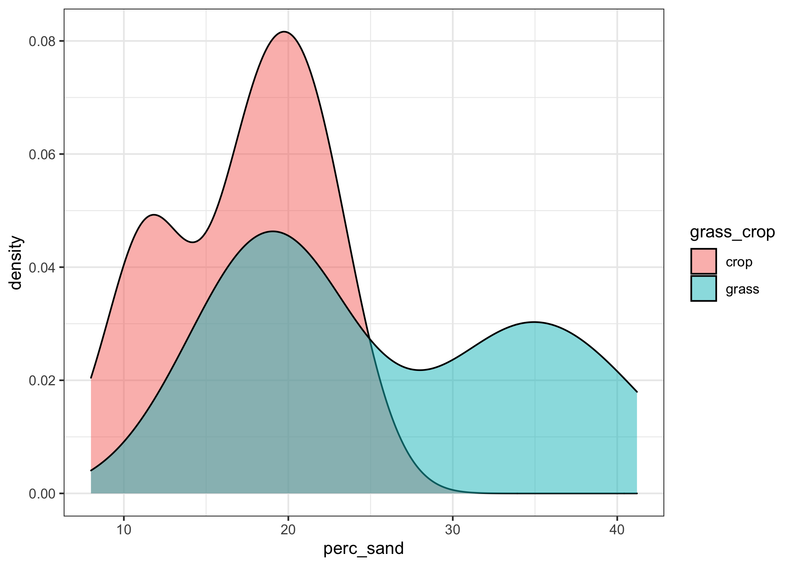

Ancillary Analyses
================
Emily Lacroix
8/21/2020

-   [Set-Up](#set-up)
    -   [Load libraries](#load-libraries)
    -   [Designate file paths](#designate-file-paths)
    -   [Figure labels](#figure-labels)
-   [Import Data](#import-data)
    -   [TC and TN data](#tc-and-tn-data)
    -   [pH data](#ph-data)
    -   [Gravimetric data](#gravimetric-data)
    -   [Texture data](#texture-data)
    -   [DOC data](#doc-data)
-   [Figures & Analysis](#figures-analysis)
    -   [Table 1: % OC and TN](#table-1-oc-and-tn)
    -   [OC & TN Stats](#oc-tn-stats)
    -   [Table 1: pH](#table-1-ph)
    -   [pH Stats](#ph-stats)
    -   [Table 1: Bulk Density](#table-1-bulk-density)
    -   [Bulk Density Stats](#bulk-density-stats)
    -   [Table 1: Texture](#table-1-texture)
    -   [Texture Stats](#texture-stats)
    -   [DOC means](#doc-means)
    -   [DOC Stats](#doc-stats)
    -   [Figure S5: DOC Boxplots](#figure-s5-doc-boxplots)

## Set-Up

### Load libraries

    library(tidyverse)
    library(readxl)
    library(car)

    conflicted::conflict_prefer("recode", "dplyr")
    conflicted::conflict_prefer("select", "dplyr")
    conflicted::conflict_prefer("filter", "dplyr")

### Designate file paths

    data_file <- "~/Desktop/TempeCell_AllData.xlsx"

### Figure labels

    field_labels <- 
      c(
        "RG-3" = "Riparian Grassland",
        "RG-2" = "Riparian Grassland",
        "RG-1" = "Riparian Grassland",
        "RG" = "Riparian Grassland",
        "3-8" = "Wheat/Cover",
        "1-6" = "Wheat/Cover",
        "7-3" = "Wheat/Cover",
        "4-9" = "Wheat/Fallow",
        "1-7" = "Wheat/Fallow",
        "8-3" = "Wheat/Fallow",
        "8-6" = "Native Grassland",
        "3-6" = "Native Grassland",
        "7-1" = "Native Grassland"
      )

## Import Data

### TC and TN data

    tc <- 
      data_file %>% 
      read_excel(sheet = "TotalCarbon", na = "NA") 

### pH data

    ph <- 
      data_file %>% 
      read_excel(sheet = "pH")

### Gravimetric data

    grav_data <- 
      read_xlsx(
        data_file, 
        sheet = "GravimetricData",
        na = "NA"
      ) 

### Texture data

    texture <-
      data_file %>% 
      read_excel(sheet = "Texture")

### DOC data

    doc <-
      data_file %>% 
      read_excel(sheet = "DissolvedOrganicCarbon") %>% 
      select(-comments) %>% 
      filter(!str_detect(sample_name, "Blank")) %>% 
      mutate(
        disturbed = if_else(str_detect(sample_name, "-D"), TRUE, FALSE)
      )

## Figures & Analysis

### Table 1: % OC and TN

    tc %>% 
      mutate_at(
        vars(field),
        ~ recode(., !!!field_labels)
      ) %>% 
      mutate(
        grass_crop = 
          if_else(
            field %in% c("Riparian Grassland", "Native Grassland"), 
            "grass", 
            "crop"
          )
      ) %>% 
      group_by(grass_crop) %>% 
      summarise_at(
        vars(perc_c, perc_n), 
        list(
          mean = ~mean(., na.rm = TRUE), 
          se = ~sd(., na.rm = TRUE) / sqrt(n())
        )
      ) %>% 
      select(grass_crop, perc_c_mean, perc_c_se, perc_n_mean, perc_n_se) %>% 
      knitr::kable()

| grass\_crop | perc\_c\_mean | perc\_c\_se | perc\_n\_mean | perc\_n\_se |
|:------------|--------------:|------------:|--------------:|------------:|
| crop        |     0.9640565 |   0.0387414 |     0.0864855 |   0.0030530 |
| grass       |     1.3085631 |   0.0863740 |     0.1091552 |   0.0054678 |

### OC & TN Stats

    tc_stats <- 
      tc %>% 
      mutate_at(
        vars(field),
        ~ recode(., !!!field_labels)
      ) %>% 
      mutate(
        grass_crop = 
          if_else(
            field %in% c("Riparian Grassland", "Native Grassland"), 
            "grass", 
            "crop"
          )
      )

    tc_stats

    ## # A tibble: 51 x 14
    ##    sample field moisture incubation_day sample_type crop  weight area_n area_c
    ##    <chr>  <chr> <chr>             <dbl> <chr>       <chr>  <dbl>  <dbl>  <dbl>
    ##  1 3-8-F… Whea… FC                    7 Fe          Whea…   20.0   22.1   689.
    ##  2 3-8-7… Whea… 70                   28 Fe          Whea…   20.1   18.5   597.
    ##  3 3-8-7… Whea… 70                   14 Fe          Whea…   20.1   18.4   595.
    ##  4 3-8-7… Whea… 70                    7 Fe          Whea…   20.2   18.2   583.
    ##  5 3-8-F… Whea… FC                   14 Fe          Whea…   19.7   17.0   569.
    ##  6 3-8-F… Whea… FC                   28 Fe          Whea…   19.1   15.9   549.
    ##  7 8-6-F… Nati… <NA>                  0 Fe          Nati…   18.4   14.8   541.
    ##  8 8-6-7… Nati… 70                    7 Fe          Nati…   19.0   14.4   507.
    ##  9 8-6-7… Nati… 70                   14 Fe          Nati…   19.6   16.8   557.
    ## 10 8-6-7… Nati… 70                   28 Fe          Nati…   19.4   15.7   546.
    ## # … with 41 more rows, and 5 more variables: weight_n <dbl>, weight_c <dbl>,
    ## #   perc_n <dbl>, perc_c <dbl>, grass_crop <chr>

    tc_stats %>% 
      group_by(grass_crop) %>% 
      ggplot(aes(x = perc_c, fill = grass_crop)) + 
      geom_density(alpha = 0.5) + 
      scale_x_continuous() + 
      theme_bw()

<!-- -->

    tc_stats %>% 
      group_by(grass_crop) %>% 
      ggplot(aes(x = perc_n, fill = grass_crop)) + 
      geom_density(alpha = 0.5) + 
      scale_x_continuous() + 
      theme_bw()

<!-- -->

    tc_stats %>% 
      group_by(grass_crop) %>% 
      summarise(
        normality_shapiro_p_oc = shapiro.test(perc_c)$p.value,
        normality_shapiro_p_tn = shapiro.test(perc_n)$p.value,
      )

    ## `summarise()` ungrouping output (override with `.groups` argument)

    ## # A tibble: 2 x 3
    ##   grass_crop normality_shapiro_p_oc normality_shapiro_p_tn
    ##   <chr>                       <dbl>                  <dbl>
    ## 1 crop                      0.100                   0.0776
    ## 2 grass                     0.00827                 0.0283

    tc_stats %>% 
      group_by(grass_crop) %>% 
      summarise(
        normality_shapiro_p_oc = shapiro.test(sqrt(perc_c))$p.value,
        normality_shapiro_p_tn = shapiro.test(sqrt(perc_n))$p.value,
      )

    ## `summarise()` ungrouping output (override with `.groups` argument)

    ## # A tibble: 2 x 3
    ##   grass_crop normality_shapiro_p_oc normality_shapiro_p_tn
    ##   <chr>                       <dbl>                  <dbl>
    ## 1 crop                       0.121                  0.0647
    ## 2 grass                      0.0119                 0.0469

    tc_stats %>% 
      group_by(grass_crop) %>% 
      summarise(
        normality_shapiro_p_oc = shapiro.test(perc_c^-3)$p.value,
        normality_shapiro_p_tn = shapiro.test(perc_n^-3)$p.value,
      )

    ## `summarise()` ungrouping output (override with `.groups` argument)

    ## # A tibble: 2 x 3
    ##   grass_crop normality_shapiro_p_oc normality_shapiro_p_tn
    ##   <chr>                       <dbl>                  <dbl>
    ## 1 crop                      0.00475                0.00346
    ## 2 grass                     0.00590                0.0213

    tc_stats %>% 
      group_by(grass_crop) %>% 
      summarise(
        normality_shapiro_p_oc = shapiro.test(log(perc_c))$p.value,
        normality_shapiro_p_tn = shapiro.test(log(perc_n))$p.value,
      )

    ## `summarise()` ungrouping output (override with `.groups` argument)

    ## # A tibble: 2 x 3
    ##   grass_crop normality_shapiro_p_oc normality_shapiro_p_tn
    ##   <chr>                       <dbl>                  <dbl>
    ## 1 crop                       0.115                  0.0491
    ## 2 grass                      0.0148                 0.0683

The grassland data are not normally distributed. Log, sqrt, and cube
root transofrmations still fail to meet the assumptions for normality.
Checking for equal variances.

    leveneTest(perc_c ~ grass_crop, data = tc_stats)

    ## Warning in leveneTest.default(y = y, group = group, ...): group coerced to
    ## factor.

    ## Levene's Test for Homogeneity of Variance (center = median)
    ##       Df F value    Pr(>F)    
    ## group  1  19.353 5.853e-05 ***
    ##       49                      
    ## ---
    ## Signif. codes:  0 '***' 0.001 '**' 0.01 '*' 0.05 '.' 0.1 ' ' 1

    leveneTest(perc_n ~ grass_crop, data = tc_stats)

    ## Warning in leveneTest.default(y = y, group = group, ...): group coerced to
    ## factor.

    ## Levene's Test for Homogeneity of Variance (center = median)
    ##       Df F value    Pr(>F)    
    ## group  1   12.36 0.0009553 ***
    ##       49                      
    ## ---
    ## Signif. codes:  0 '***' 0.001 '**' 0.01 '*' 0.05 '.' 0.1 ' ' 1

Variances are not equal.

    wilcox.test(
      tc_stats$perc_c ~ tc_stats$grass_crop, 
      paired = FALSE
    )

    ## 
    ##  Wilcoxon rank sum exact test
    ## 
    ## data:  tc_stats$perc_c by tc_stats$grass_crop
    ## W = 189, p-value = 0.009825
    ## alternative hypothesis: true location shift is not equal to 0

    wilcox.test(
      tc_stats$perc_n ~ tc_stats$grass_crop, 
      paired = FALSE
    )

    ## 
    ##  Wilcoxon rank sum exact test
    ## 
    ## data:  tc_stats$perc_n by tc_stats$grass_crop
    ## W = 182, p-value = 0.006497
    ## alternative hypothesis: true location shift is not equal to 0

### Table 1: pH

    ph %>% 
      mutate(
        grass_crop = 
          if_else(
            crop %in% c("Riparian Grassland", "Native Grassland"), 
            "grass", 
            "crop"
          )
      ) %>% 
      group_by(grass_crop) %>% 
      summarise_at(
        vars(pH), 
        list(
          mean = ~mean(., na.rm = TRUE), 
          se = ~sd(., na.rm = TRUE) / sqrt(n())
        )
      ) %>% 
      knitr::kable()

| grass\_crop |     mean |        se |
|:------------|---------:|----------:|
| crop        | 6.676458 | 0.0428748 |
| grass       | 6.846458 | 0.0447981 |

### pH Stats

    ph_stats <- 
      ph %>% 
      mutate(
        grass_crop = 
          if_else(
            crop %in% c("Riparian Grassland", "Native Grassland"), 
            "grass", 
            "crop"
          )
      ) 

    ph_stats %>% 
      group_by(grass_crop) %>% 
      ggplot(aes(x = pH, fill = grass_crop)) + 
      geom_density(alpha = 0.5) + 
      scale_x_continuous() + 
      theme_bw()

<!-- -->

    ph_stats %>% 
      group_by(grass_crop) %>% 
      summarise(
        normality_p_val = shapiro.test(pH)$p.value
      )

    ## `summarise()` ungrouping output (override with `.groups` argument)

    ## # A tibble: 2 x 2
    ##   grass_crop normality_p_val
    ##   <chr>                <dbl>
    ## 1 crop                0.0134
    ## 2 grass               0.271

The crop data are non-normal

    leveneTest(pH ~ grass_crop, data = ph_stats)

    ## Warning in leveneTest.default(y = y, group = group, ...): group coerced to
    ## factor.

    ## Levene's Test for Homogeneity of Variance (center = median)
    ##       Df F value Pr(>F)
    ## group  1  0.1707 0.6804
    ##       94

The variances are equal. Use Wilcoxon rank-sum (Mann Whitney U) test.

    wilcox.test(
      ph_stats$pH ~ ph_stats$grass_crop, 
      paired = FALSE
    )

    ## Warning in wilcox.test.default(x = c(6.72, 6.72, 6.76, 6.44, 6.52, 6.58, :
    ## cannot compute exact p-value with ties

    ## 
    ##  Wilcoxon rank sum test with continuity correction
    ## 
    ## data:  ph_stats$pH by ph_stats$grass_crop
    ## W = 796.5, p-value = 0.009262
    ## alternative hypothesis: true location shift is not equal to 0

### Table 1: Bulk Density

This focuses only on field cores, not disturbed cores as that bulk
density is contrived.

    grav_data %>% 
      mutate_at(
        vars(field),
        ~ recode(., !!!field_labels)
      ) %>% 
      filter(disturbed == FALSE) %>% 
      mutate(
        grass_crop = 
          if_else(
            field %in% c("Riparian Grassland", "Native Grassland"), 
            "grass", 
            "crop"
          )
      ) %>% 
      group_by(grass_crop) %>% 
      summarise_at(
        vars(bulk_dens), 
        list(
          mean_bulk_dens = ~mean(., na.rm = TRUE), 
          se_bulk_dens = ~sd(., na.rm = TRUE) / sqrt(n())
        )
      ) %>% 
      knitr::kable()

| grass\_crop | mean\_bulk\_dens | se\_bulk\_dens |
|:------------|-----------------:|---------------:|
| crop        |         1.156066 |      0.0118193 |
| grass       |         1.325178 |      0.0141460 |

### Bulk Density Stats

    bulk_dens_stats <- 
      grav_data %>% 
      mutate_at(
        vars(field),
        ~ recode(., !!!field_labels)
      ) %>% 
      filter(disturbed == FALSE) %>% 
      mutate(
        grass_crop = 
          if_else(
            field %in% c("Riparian Grassland", "Native Grassland"), 
            "grass", 
            "crop"
          )
      ) 

    bulk_dens_stats %>% 
      group_by(grass_crop) %>% 
      ggplot(aes(x = bulk_dens, fill = grass_crop)) + 
      geom_histogram() +
      #geom_density(alpha = 0.5) + 
      scale_x_continuous() + 
      theme_bw()

    ## `stat_bin()` using `bins = 30`. Pick better value with `binwidth`.

<!-- -->

Test for normality

    bulk_dens_stats %>% 
      group_by(grass_crop) %>% 
      summarise(
        normality_p_val = shapiro.test(bulk_dens)$p.value
      )

    ## `summarise()` ungrouping output (override with `.groups` argument)

    ## # A tibble: 2 x 2
    ##   grass_crop normality_p_val
    ##   <chr>                <dbl>
    ## 1 crop                0.0227
    ## 2 grass               0.236

Test for equal variances

    leveneTest(bulk_dens ~ grass_crop, data = bulk_dens_stats)

    ## Warning in leveneTest.default(y = y, group = group, ...): group coerced to
    ## factor.

    ## Levene's Test for Homogeneity of Variance (center = median)
    ##        Df F value  Pr(>F)  
    ## group   1  3.2021 0.07567 .
    ##       142                  
    ## ---
    ## Signif. codes:  0 '***' 0.001 '**' 0.01 '*' 0.05 '.' 0.1 ' ' 1

Variances are equal.

Wilcoxon Rank Sum Test

    wilcox.test(
      bulk_dens_stats$bulk_dens ~ bulk_dens_stats$grass_crop, 
      paired = FALSE
    )

    ## 
    ##  Wilcoxon rank sum test with continuity correction
    ## 
    ## data:  bulk_dens_stats$bulk_dens by bulk_dens_stats$grass_crop
    ## W = 726.5, p-value = 9.216e-14
    ## alternative hypothesis: true location shift is not equal to 0

### Table 1: Texture

    texture %>% 
      mutate(
        grass_crop = 
          case_when(
            str_detect(sample, "^(WF|WC|CW)") ~ "crop",
            str_detect(sample, "^(NG|RG)") ~ "grass"
          )
      ) %>% 
      group_by(grass_crop) %>% 
      summarise_at(
        vars(perc_sand, perc_silt, perc_clay), 
        list(
          mean = ~mean(., na.rm = TRUE),
          se = ~sd(., na.rm = TRUE) / sqrt(n())
        )
      ) %>% 
      select(
        grass_crop,
        perc_sand_mean,
        perc_sand_se,
        perc_silt_mean,
        perc_silt_se,
        perc_clay_mean,
        perc_clay_se
      ) %>% 
      knitr::kable()

| grass\_crop | perc\_sand\_mean | perc\_sand\_se | perc\_silt\_mean | perc\_silt\_se | perc\_clay\_mean | perc\_clay\_se |
|:------------|-----------------:|---------------:|-----------------:|---------------:|-----------------:|---------------:|
| crop        |         17.27308 |      0.9119979 |         62.90385 |      0.6923423 |         19.81154 |      0.2970277 |
| grass       |         25.99524 |      1.9353783 |         57.24762 |      1.1413989 |         16.76667 |      0.8588845 |

### Texture Stats

    texture_stats <- 
      texture %>% 
        mutate(
        grass_crop = 
          case_when(
            str_detect(sample, "^(WF|WC|CW)") ~ "crop",
            str_detect(sample, "^(NG|RG)") ~ "grass"
          )
      )

    texture_stats %>%  
      group_by(grass_crop) %>% 
      ggplot(aes(x = perc_sand, fill = grass_crop)) + 
      geom_density(alpha = 0.5) + 
      scale_x_continuous() + 
      theme_bw()

<!-- -->

    texture %>% 
        mutate(
        grass_crop = 
          case_when(
            str_detect(sample, "^(WF|WC|CW)") ~ "crop",
            str_detect(sample, "^(NG|RG)") ~ "grass"
          )
      ) %>% 
      group_by(grass_crop) %>% 
      ggplot(aes(x = perc_silt, fill = grass_crop)) + 
      geom_density(alpha = 0.5) + 
      scale_x_continuous() + 
      theme_bw()

<!-- -->

    texture_stats %>% 
      group_by(grass_crop) %>% 
      ggplot(aes(x = perc_clay, fill = grass_crop)) + 
      geom_density(alpha = 0.5) + 
      scale_x_continuous() + 
      theme_bw()

<!-- -->

    texture_stats %>% 
      group_by(grass_crop) %>% 
      summarise(
        normality_p_val_sand = shapiro.test(perc_sand)$p.value,
        normality_p_val_silt = shapiro.test(perc_silt)$p.value,
        normality_p_val_clay = shapiro.test(perc_clay)$p.value
      )

    ## `summarise()` ungrouping output (override with `.groups` argument)

    ## # A tibble: 2 x 4
    ##   grass_crop normality_p_val_sand normality_p_val_silt normality_p_val_clay
    ##   <chr>                     <dbl>                <dbl>                <dbl>
    ## 1 crop                     0.154                 0.398              0.410  
    ## 2 grass                    0.0136                0.167              0.00270

    leveneTest(perc_sand ~ grass_crop, data = texture_stats) #unequal variances

    ## Warning in leveneTest.default(y = y, group = group, ...): group coerced to
    ## factor.

    ## Levene's Test for Homogeneity of Variance (center = median)
    ##       Df F value   Pr(>F)   
    ## group  1  8.3634 0.005878 **
    ##       45                    
    ## ---
    ## Signif. codes:  0 '***' 0.001 '**' 0.01 '*' 0.05 '.' 0.1 ' ' 1

    leveneTest(perc_silt ~ grass_crop, data = texture_stats) #equal variances

    ## Warning in leveneTest.default(y = y, group = group, ...): group coerced to
    ## factor.

    ## Levene's Test for Homogeneity of Variance (center = median)
    ##       Df F value Pr(>F)
    ## group  1  2.7302 0.1054
    ##       45

    leveneTest(perc_clay ~ grass_crop, data = texture_stats) #unequal variances

    ## Warning in leveneTest.default(y = y, group = group, ...): group coerced to
    ## factor.

    ## Levene's Test for Homogeneity of Variance (center = median)
    ##       Df F value    Pr(>F)    
    ## group  1  15.476 0.0002863 ***
    ##       45                      
    ## ---
    ## Signif. codes:  0 '***' 0.001 '**' 0.01 '*' 0.05 '.' 0.1 ' ' 1

Wilcoxon Rank Sum Test

    wilcox.test(
      texture_stats$perc_sand ~ texture_stats$grass_crop, 
      paired = FALSE
    )

    ## Warning in wilcox.test.default(x = c(21.3, 11.8, 19.2, 21.4, 17.8, 23.2, :
    ## cannot compute exact p-value with ties

    ## 
    ##  Wilcoxon rank sum test with continuity correction
    ## 
    ## data:  texture_stats$perc_sand by texture_stats$grass_crop
    ## W = 128.5, p-value = 0.002058
    ## alternative hypothesis: true location shift is not equal to 0

    wilcox.test(
      texture_stats$perc_silt ~ texture_stats$grass_crop, 
      paired = FALSE
    )

    ## Warning in wilcox.test.default(x = c(58.5, 65.9, 61.2, 60, 62.5, 59.7, 63, :
    ## cannot compute exact p-value with ties

    ## 
    ##  Wilcoxon rank sum test with continuity correction
    ## 
    ## data:  texture_stats$perc_silt by texture_stats$grass_crop
    ## W = 437, p-value = 0.000466
    ## alternative hypothesis: true location shift is not equal to 0

    wilcox.test(
      texture_stats$perc_clay ~ texture_stats$grass_crop, 
      paired = FALSE
    )

    ## Warning in wilcox.test.default(x = c(20.2, 22.3, 19.6, 18.6, 19.7, 17.1, :
    ## cannot compute exact p-value with ties

    ## 
    ##  Wilcoxon rank sum test with continuity correction
    ## 
    ## data:  texture_stats$perc_clay by texture_stats$grass_crop
    ## W = 369, p-value = 0.04092
    ## alternative hypothesis: true location shift is not equal to 0

### DOC means

    doc %>% 
      group_by(disturbed) %>% 
      summarise(
        mean_doc = mean(blank_corrected_mg_l, na.rm = TRUE),
        se_doc = sd(blank_corrected_mg_l, na.rm = TRUE) / sqrt(n())
      ) %>% 
      knitr::kable()

    ## `summarise()` ungrouping output (override with `.groups` argument)

| disturbed | mean\_doc |   se\_doc |
|:----------|----------:|----------:|
| FALSE     |  24.32253 |  2.423394 |
| TRUE      |  89.40139 | 14.828322 |

### DOC Stats

    doc %>% 
      ggplot(aes(x = blank_corrected_mg_l, fill = disturbed)) + 
      geom_density(alpha = 0.5) + 
      scale_x_continuous(limits = c(0, 250))

<!-- -->

    doc %>% 
      group_by(disturbed) %>% 
      summarise(
        normality_p = shapiro.test(blank_corrected_mg_l)$p.value
      )

    ## `summarise()` ungrouping output (override with `.groups` argument)

    ## # A tibble: 2 x 2
    ##   disturbed normality_p
    ##   <lgl>           <dbl>
    ## 1 FALSE          0.825 
    ## 2 TRUE           0.0960

The data are approximately normally distributed (alpha = 0.05).

    leveneTest(
      blank_corrected_mg_l ~ disturbed, 
      data = doc %>% 
        filter(!str_detect(sample_name, "Blank")) %>% 
        mutate(
          disturbed = if_else(str_detect(sample_name, "-D"), TRUE, FALSE)
        ) 
    )

    ## Warning in leveneTest.default(y = y, group = group, ...): group coerced to
    ## factor.

    ## Levene's Test for Homogeneity of Variance (center = median)
    ##       Df F value  Pr(>F)  
    ## group  1  8.2762 0.01219 *
    ##       14                  
    ## ---
    ## Signif. codes:  0 '***' 0.001 '**' 0.01 '*' 0.05 '.' 0.1 ' ' 1

However, the variances are unequal.

    t.test(
      x = doc %>% filter(disturbed == TRUE) %>% pull(blank_corrected_mg_l),
      y = doc %>% filter(disturbed == FALSE) %>% pull(blank_corrected_mg_l),
      var.equal = FALSE
      )

    ## 
    ##  Welch Two Sample t-test
    ## 
    ## data:  doc %>% filter(disturbed == TRUE) %>% pull(blank_corrected_mg_l) and doc %>% filter(disturbed == FALSE) %>% pull(blank_corrected_mg_l)
    ## t = 4.3314, df = 7.3737, p-value = 0.003037
    ## alternative hypothesis: true difference in means is not equal to 0
    ## 95 percent confidence interval:
    ##   29.91201 100.24570
    ## sample estimates:
    ## mean of x mean of y 
    ##  89.40139  24.32254

### Figure S5: DOC Boxplots

    doc %>% 
      filter(!str_detect(sample_name, "Blank")) %>% 
      mutate(
        disturbed = if_else(str_detect(sample_name, "-D"), TRUE, FALSE)
      ) %>% 
      ggplot(aes(x = disturbed, y = blank_corrected_mg_l, fill = disturbed)) + 
      geom_boxplot(color = "black") + 
      scale_fill_manual(values = c("gray60", "grey12")) + 
      scale_x_discrete(
        labels = c("Undisturbed\nGrassland", "Disturbed\nGrassland")
      ) + 
      labs(
        x = NULL,
        y = "DOC mg / L"
      ) + 
      theme_classic() + 
      theme(
        legend.position = "none"
      )

<!-- -->
