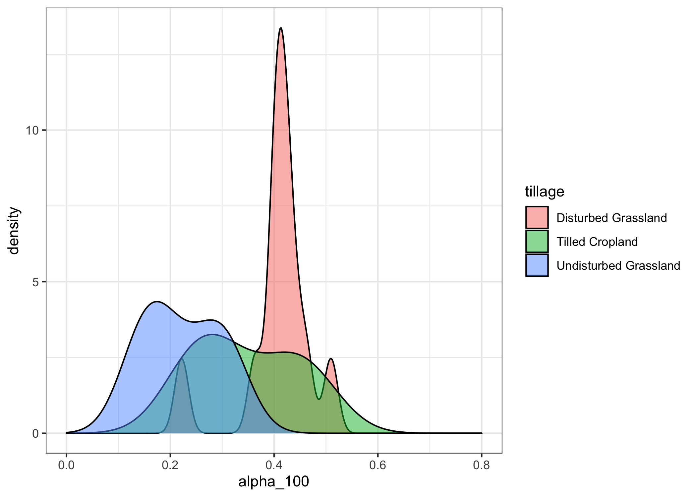
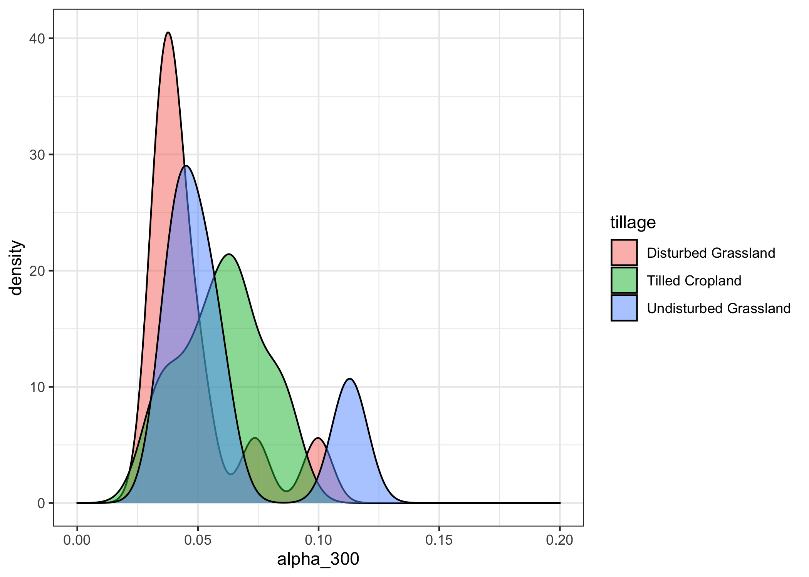
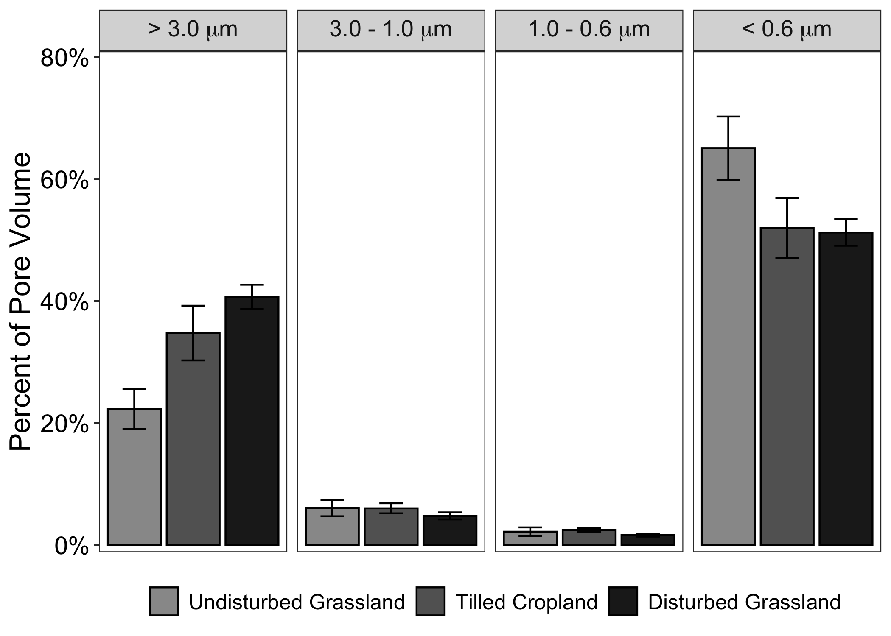

Pore Volume Analysis & Figures
================
Emily Lacroix
8/21/2020

-   [Set-Up](#set-up)
    -   [Load libraries](#load-libraries)
    -   [Designate filepaths](#designate-filepaths)
    -   [Figure labels](#figure-labels)
-   [Import & Clean Data](#import-clean-data)
    -   [Import](#import)
    -   [Clean-up data](#clean-up-data)
-   [Statistics](#statistics)
    -   [Density Plots](#density-plots)
    -   [Test for normality with the Shapiro
        test](#test-for-normality-with-the-shapiro-test)
    -   [Check for equal variances with Levene’s
        test](#check-for-equal-variances-with-levenes-test)
    -   [Table S5: Pairwise Wilcoxon rank sum test for percent pore
        volumes](#table-s5-pairwise-wilcoxon-rank-sum-test-for-percent-pore-volumes)
-   [Figures & Tables](#figures-tables)
    -   [Table S2: Mean and SEMs by pore size and
        disturbance](#table-s2-mean-and-sems-by-pore-size-and-disturbance)
    -   [Section 3.2: Average pores &lt; 0.6
        micron](#section-3.2-average-pores-0.6-micron)
    -   [Figure 1. Percent Pore Volume](#figure-1.-percent-pore-volume)

Set-Up
------

### Load libraries

    library(tidyverse)
    library(readxl)
    library(car)

    conflicted::conflict_prefer("recode", "dplyr")
    conflicted::conflict_prefer("select", "dplyr")
    conflicted::conflict_prefer("filter", "dplyr")

### Designate filepaths

    data_file <- "~/Desktop/TempeCell_MasterSpreadsheet.xlsx"

### Figure labels

    #Field key
    fields <- 
      tribble(
        ~crop_type, ~fields,
        "Native Grassland", c("7-1", "8-6", "3-6"),
        "Riparian Grassland", c("RG-1", "RG-2", "RG-3"),
        "Wheat/Cover", c("1-6", "3-8", "7-3"),
        "Wheat/Fallow", c("1-7", "4-9", "8-3"),
      ) %>% 
      unnest()

Import & Clean Data
-------------------

### Import

    grav_data <- 
      read_xlsx(
        data_file, 
        sheet = "GravimetricData",
        na = "NA"
      )

### Clean-up data

Read in all of the moisture data with the following filtering:

-   remove Fe/Mn cores (we have no extraction data on these)
-   Remove any cores that lost &gt;= 5 g of moist soil under filter
    removal after extraction
-   Retain all cores with &gt; 95% WFPS (effectively saturated)
-   Retain cores for which water recovered through pore water extraction
    and/or final oven drying (mw\_resid) is 90-110% of the total soil
    pore volume as calculated by bulk density; assumed particle density
    of 2.65 g/cm3

<!-- -->

    filtered_grav_data <- 
      grav_data %>% 
      filter(!str_detect(sample, "Fe")) %>%
      mutate(
        mw_resid =
          (extracted_soil + amount_removed - filter) -
          (dry_mass + ring_g + dry_boat_g),
        bulk_dens = dry_mass / ring_vol_cm3,
        porosity = 1 - (bulk_dens / 2.65),
        soil_pore_vol = porosity * ring_vol_cm3,
        alpha_100 = mw_100 / soil_pore_vol,
        alpha_300 = mw_300 / soil_pore_vol,
        alpha_500 = mw_500 / soil_pore_vol,
        alpha_less_than_500 = mw_resid / soil_pore_vol
      ) %>%
      drop_na(mw_100, mw_300, mw_500) %>%
      filter(wfps > 0.95) %>%
      mutate(
        error =
          (mw_100 + mw_300 + mw_500 + mw_resid - soil_pore_vol) / soil_pore_vol
      )  %>%
      filter(abs(error) <= 0.10) %>%
      left_join(fields, by = c("field" = "fields")) %>%
      mutate(
        tillage =
          case_when(
            crop_type %in% c("Wheat/Fallow", "Wheat/Cover") ~ "Tilled Cropland",
            crop_type %in% c("Native Grassland", "Riparian Grassland") &
              disturbed == FALSE ~ "Undisturbed Grassland",
            crop_type %in% c("Native Grassland", "Riparian Grassland") &
              disturbed == TRUE ~ "Disturbed Grassland"
          )
      ) %>% 
      filter(amount_removed < 5)

Statistics
----------

### Density Plots

Density plots of each of the proportion pore volumes for the cores
(after quality filtering)

    filtered_grav_data %>% 
      ggplot(aes(x = alpha_100, fill = tillage)) + 
      geom_density(alpha = 0.5) + 
      scale_x_continuous(limits = c(0,0.8)) + 
      theme_bw()

<!-- -->

    filtered_grav_data %>% 
      ggplot(aes(x = alpha_300, fill = tillage)) + 
      geom_density(alpha = 0.5) + 
      scale_x_continuous(limits = c(0,0.2)) + 
      theme_bw()

<!-- -->

    filtered_grav_data %>% 
      ggplot(aes(x = alpha_500, fill = tillage)) + 
      geom_density(alpha = 0.5) + 
      scale_x_continuous(limits = c(0,0.1)) + 
      theme_bw()

<!-- -->

    filtered_grav_data %>% 
      ggplot(aes(x = alpha_less_than_500, fill = tillage)) + 
      geom_density(alpha = 0.5) + 
      scale_x_continuous(limits = c(0,1)) + 
      theme_bw()

<!-- -->

### Test for normality with the Shapiro test

    filtered_grav_data %>% 
      group_by(tillage) %>%
      summarise_at(vars(contains("alpha")), ~shapiro.test(.)$p.value) %>% 
      rename_at(vars(contains("alpha")), ~ str_c(., "_shapiro_p")) %>% 
      knitr::kable()

| tillage               | alpha\_100\_shapiro\_p | alpha\_300\_shapiro\_p | alpha\_500\_shapiro\_p | alpha\_less\_than\_500\_shapiro\_p |
|:----------------------|-----------------------:|-----------------------:|-----------------------:|-----------------------------------:|
| Disturbed Grassland   |              0.0179397 |              0.0012884 |              0.1638091 |                          0.0276150 |
| Tilled Cropland       |              0.3198208 |              0.9944720 |              0.3155604 |                          0.8757735 |
| Undisturbed Grassland |              0.4111700 |              0.0423338 |              0.2922596 |                          0.4783996 |

Disturbed grassland pore volumes are NOT normal (for &gt;3um, 1-3 um
kPa, and &lt; 0.6 um)

### Check for equal variances with Levene’s test

    leveneTest(alpha_100 ~ tillage, data = filtered_grav_data)

    ## Levene's Test for Homogeneity of Variance (center = median)
    ##       Df F value Pr(>F)
    ## group  2  1.0683 0.3634
    ##       19

    leveneTest(alpha_300 ~ tillage, data = filtered_grav_data)

    ## Levene's Test for Homogeneity of Variance (center = median)
    ##       Df F value Pr(>F)
    ## group  2  0.1988 0.8214
    ##       19

    leveneTest(alpha_500 ~ tillage, data = filtered_grav_data)

    ## Levene's Test for Homogeneity of Variance (center = median)
    ##       Df F value Pr(>F)
    ## group  2  0.9807 0.3933
    ##       19

    leveneTest(alpha_less_than_500 ~ tillage, data = filtered_grav_data)

    ## Levene's Test for Homogeneity of Variance (center = median)
    ##       Df F value Pr(>F)
    ## group  2  0.6376 0.5395
    ##       19

All of the population variances are equal. Now we can use a pairwise
Wilcox test to look for differences.

### Table S5: Pairwise Wilcoxon rank sum test for percent pore volumes

    pairwise.wilcox.test(
      x = filtered_grav_data$alpha_100, 
      g = filtered_grav_data$tillage, 
      p.adjust.method = "BH", 
      paired = FALSE
    )

    ## 
    ##  Pairwise comparisons using Wilcoxon rank sum test 
    ## 
    ## data:  filtered_grav_data$alpha_100 and filtered_grav_data$tillage 
    ## 
    ##                       Disturbed Grassland Tilled Cropland
    ## Tilled Cropland       0.5058              -              
    ## Undisturbed Grassland 0.0039              0.1429         
    ## 
    ## P value adjustment method: BH

    pairwise.wilcox.test(
      x = filtered_grav_data$alpha_300, 
      g = filtered_grav_data$tillage, 
      p.adjust.method = "BH", 
      paired = FALSE
    )

    ## 
    ##  Pairwise comparisons using Wilcoxon rank sum test 
    ## 
    ## data:  filtered_grav_data$alpha_300 and filtered_grav_data$tillage 
    ## 
    ##                       Disturbed Grassland Tilled Cropland
    ## Tilled Cropland       0.29                -              
    ## Undisturbed Grassland 0.29                0.69           
    ## 
    ## P value adjustment method: BH

    pairwise.wilcox.test(
      x = filtered_grav_data$alpha_500, 
      g = filtered_grav_data$tillage, 
      p.adjust.method = "BH", 
      paired = FALSE
    )

    ## Warning in wilcox.test.default(xi, xj, paired = paired, ...): cannot
    ## compute exact p-value with ties

    ## Warning in wilcox.test.default(xi, xj, paired = paired, ...): cannot
    ## compute exact p-value with ties

    ## 
    ##  Pairwise comparisons using Wilcoxon rank sum test 
    ## 
    ## data:  filtered_grav_data$alpha_500 and filtered_grav_data$tillage 
    ## 
    ##                       Disturbed Grassland Tilled Cropland
    ## Tilled Cropland       0.31                -              
    ## Undisturbed Grassland 0.64                0.63           
    ## 
    ## P value adjustment method: BH

    pairwise.wilcox.test(
      x = filtered_grav_data$alpha_less_than_500, 
      g = filtered_grav_data$tillage, 
      p.adjust.method = "BH", 
      paired = FALSE
    )

    ## 
    ##  Pairwise comparisons using Wilcoxon rank sum test 
    ## 
    ## data:  filtered_grav_data$alpha_less_than_500 and filtered_grav_data$tillage 
    ## 
    ##                       Disturbed Grassland Tilled Cropland
    ## Tilled Cropland       1.00                -              
    ## Undisturbed Grassland 0.11                0.14           
    ## 
    ## P value adjustment method: BH

Figures & Tables
----------------

### Table S2: Mean and SEMs by pore size and disturbance

    filtered_grav_data %>% 
      group_by(tillage) %>%
      summarise_at(
        vars(contains("alpha")),
        list(
          mean = ~ 100 * mean(., na.rm = TRUE),
          se = ~ 100 * sd(., na.rm = TRUE)/sqrt(n())
        )
      ) %>%
      select(
        tillage,
        alpha_100_mean,
        alpha_100_se,
        alpha_300_mean,
        alpha_300_se,
        alpha_500_mean,
        alpha_500_se,
        alpha_less_than_500_mean,
        alpha_less_than_500_se
      ) %>% 
      mutate(
        total_pore_proportions = 
          alpha_100_mean + 
          alpha_300_mean + 
          alpha_500_mean + 
          alpha_less_than_500_mean
      ) %>% 
      arrange(rev(tillage)) %>% 
      mutate_at(vars(starts_with("alpha")), round, digits = 3)

    ## # A tibble: 3 x 10
    ##   tillage alpha_100_mean alpha_100_se alpha_300_mean alpha_300_se
    ##   <chr>            <dbl>        <dbl>          <dbl>        <dbl>
    ## 1 Undist…           22.3         3.29           6.04        1.35 
    ## 2 Tilled…           34.7         4.49           6.00        0.829
    ## 3 Distur…           40.7         1.98           4.76        0.576
    ## # … with 5 more variables: alpha_500_mean <dbl>, alpha_500_se <dbl>,
    ## #   alpha_less_than_500_mean <dbl>, alpha_less_than_500_se <dbl>,
    ## #   total_pore_proportions <dbl>

      #knitr::kable()

    filtered_grav_data %>% 
      group_by(tillage) %>%
      summarise_at(
        vars(contains("alpha")),
        list(
          mean = ~ mean(., na.rm = TRUE),
          se = ~ sd(., na.rm = TRUE)/sqrt(n())
        )
      ) %>%
      select(
        tillage,
        alpha_100_mean,
        alpha_100_se,
        alpha_300_mean,
        alpha_300_se,
        alpha_500_mean,
        alpha_500_se,
        alpha_less_than_500_mean,
        alpha_less_than_500_se
      ) %>% 
      mutate(
        total_pore_proportions = 
          alpha_100_mean + 
          alpha_300_mean + 
          alpha_500_mean + 
          alpha_less_than_500_mean
      ) %>% 
      arrange(rev(tillage)) %>% 
      mutate_at(vars(starts_with("alpha")), round, digits = 4)

    ## # A tibble: 3 x 10
    ##   tillage alpha_100_mean alpha_100_se alpha_300_mean alpha_300_se
    ##   <chr>            <dbl>        <dbl>          <dbl>        <dbl>
    ## 1 Undist…          0.223       0.0329         0.0604      0.0135 
    ## 2 Tilled…          0.347       0.0448         0.06        0.0083 
    ## 3 Distur…          0.407       0.0198         0.0476      0.00580
    ## # … with 5 more variables: alpha_500_mean <dbl>, alpha_500_se <dbl>,
    ## #   alpha_less_than_500_mean <dbl>, alpha_less_than_500_se <dbl>,
    ## #   total_pore_proportions <dbl>

### Section 3.2: Average pores &lt; 0.6 micron

    filtered_grav_data %>% 
      group_by(tillage) %>%
      summarise_at(
        vars(contains("alpha")),
        list(
          mean = ~ 100 * mean(., na.rm = TRUE),
          se = ~ 100 * sd(., na.rm = TRUE)/sqrt(n())
        )
      ) %>%
      select(
        tillage,
        alpha_100_mean,
        alpha_100_se,
        alpha_300_mean,
        alpha_300_se,
        alpha_500_mean,
        alpha_500_se,
        alpha_less_than_500_mean,
        alpha_less_than_500_se
      ) %>% 
      summarise(mean(alpha_less_than_500_mean))

    ## # A tibble: 1 x 1
    ##   `mean(alpha_less_than_500_mean)`
    ##                              <dbl>
    ## 1                             56.1

### Figure 1. Percent Pore Volume

    filtered_grav_data %>% 
      group_by(tillage) %>%
      summarise_at(
        vars(contains("alpha")),
        list(
          mean = ~mean(., na.rm = TRUE),
          se = ~sd(., na.rm = TRUE)/sqrt(n())
        )
      ) %>%
      select(
        tillage,
        alpha_100_mean,
        alpha_100_se,
        alpha_300_mean,
        alpha_300_se,
        alpha_500_mean,
        alpha_500_se,
        alpha_less_than_500_mean,
        alpha_less_than_500_se
      ) %>% 
      pivot_longer(
        cols = 
          c(
            alpha_100_mean, 
            alpha_300_mean, 
            alpha_500_mean, 
            alpha_less_than_500_mean,
            alpha_100_se, 
            alpha_300_se, 
            alpha_500_se, 
            alpha_less_than_500_se
          ),
        names_to = "pore_size_value",
        values_to = "proportion"
      ) %>% 
      mutate(
        value = str_extract(pore_size_value, "mean|se"),
      ) %>% 
      mutate_at(
        vars(pore_size_value), 
        ~ str_replace(., "_mean|_se", "")
      ) %>% 
      pivot_wider(
        id_cols = c(tillage, pore_size_value),
        names_from = value,
        values_from = proportion
      ) %>% 
      mutate_at(
        vars(tillage),
        ~ factor(
          .,
          levels =
            c(
              "Undisturbed Grassland",
              "Tilled Cropland",
              "Disturbed Grassland"
            )
        )
      ) %>% 
      mutate_at(
        vars(pore_size_value),
        ~ factor(
          .,
          levels = c("alpha_100", "alpha_300", "alpha_500", "alpha_less_than_500"),
          ordered = TRUE,
          labels =
            c(
              expression(paste("> 3.0 ", mu, "m")),
              expression(paste("3.0 - 1.0 ", mu, "m")),
              expression(paste("1.0 - 0.6 ", mu, "m")),
              expression(paste("< 0.6 ", mu, "m"))
            )
        )
      ) %>% 
      ggplot(aes(y = mean, x = tillage, fill = tillage)) + 
      geom_col(color = "black") + 
      geom_errorbar(aes(ymin = mean - se, ymax = mean + se), width = 0.4) + 
      scale_fill_manual(values = c("gray60", "grey39", "grey12")) + 
      scale_y_continuous(
        labels = scales::percent_format(accuracy = 1),
        expand = c(0.01,0.005, 0.01, 0.1)
      ) + 
      facet_grid(cols = vars(pore_size_value), labeller = label_parsed) + 
      labs(
        fill = NULL,
        x = NULL,
        y = "Percent of Pore Volume"
      ) + 
      theme_bw() + 
      theme(
        rect = element_rect(fill = "transparent"),
        axis.text.x = element_blank(),
        axis.ticks.x = element_blank(),
        legend.position = "bottom",
        axis.text.y = element_text(size = 14, color = "black"),
        axis.title.y = element_text(size = 16), 
        legend.text = element_text(size = 12),
        strip.text.x = element_text(size = 13, face = "bold"),
        panel.background = element_rect(fill = "transparent"), 
        plot.background = element_rect(fill = "transparent", color = NA), 
        panel.grid.major = element_blank(), 
        panel.grid.minor = element_blank()
      ) 

<!-- -->
